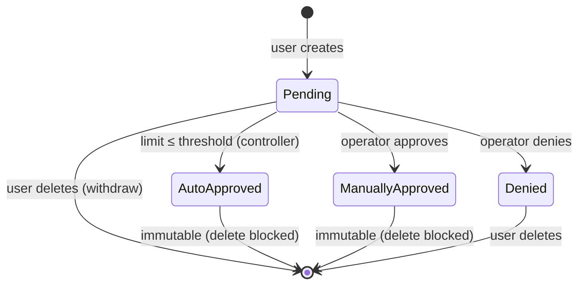

# Public API Quota: Namespace-Scoped Resource Limits with Auto-Approved QuotaRequests

***Scope***: GCP-HCP

**Date**: 2026-09-24

## Decision

We will implement a namespace-scoped quota system in the gecko public API that enforces per-project limits on HostedCluster and NodePool resources, rejects quota-exceeding creation requests with `HTTP 403`, and automatically approves `QuotaRequest` objects when they fall within configurable thresholds stored on the `Quota` resource. A `QuotaRequest` resource allows users to request limit increases with a justification; the quota controller evaluates each request against the auto-approve thresholds and either approves it immediately or leaves it pending for operator review.

## Context

The GCP HCP public API is a multi-tenant service where a single tenant's workload can exhaust shared infrastructure — PSC service attachments, GKE node capacity, control-plane compute — before GCP-level hard limits surface. Beyond infrastructure protection, unrestricted provisioning exposes customers to accidental large bills if automation or operator error creates far more clusters than intended.

- **Problem Statement**\
  Without application-level quota enforcement, a single project can:
  - Exhaust GCP PSC service attachment limits (50–500 per management cluster), impacting all tenants sharing that cluster.
  - Incur unexpectedly large cloud bills through accidental over-provisioning (runaway automation, misconfigured scripts).
  - Starve other projects of capacity without any prior notice or escalation path.
  - Bypass per-project fairness — a high-traffic project receives the same share of capacity as a low-traffic one with no mechanism to adjust dynamically.
- **Constraints**\
  Quota enforcement must be atomic with object creation — a request that would exceed quota must be rejected before the object is persisted. Quota state must be authoritative and consistent even under concurrent creation requests. Quota limits must be visible to users at any time and adjustable via a supported workflow. The mechanism must not introduce disproportionate latency on the common (non-quota-exceeding) path.
- **Assumptions**\
  Namespace equals project: the existing Cedar authorization model already treats namespace as the unit of tenant isolation, and quota inherits this boundary. The gecko API server's storage backend (PostgreSQL/Spanner) supports transactional reads under write isolation sufficient for atomic quota checks. Base limits (50 HostedClusters, 500 NodePools per namespace) are conservative enough to serve the majority of tenants without manual intervention while still protecting shared infrastructure. Sub-minute burst protection is handled separately at the ESPv2 layer via Cloud Endpoints rate limits.

## Alternatives Considered

1. **Application-level quota with auto-approved QuotaRequests (chosen)**\
   Gecko enforces quota atomically inside the creation handler. Users submit `QuotaRequest` objects to raise their limit; the quota controller automatically approves requests that fall within per-namespace thresholds, removing operator toil for routine growth while keeping humans in the loop for large or unusual increases.
2. **Automatic limit scaling without QuotaRequests**\
   The quota controller silently adjusts limits based on observed utilization — no user action required. Transparent to users but removes the explicit request/approval audit trail and gives users no agency to request capacity ahead of need.
3. **ESPv2 / Cloud Endpoints quota only**\
   Enforce per-API-key or per-consumer quota purely at the ESPv2 sidecar layer via Service Infrastructure `Check` calls. Cloud Endpoints supports per-method quota on a per-consumer basis configured through the OpenAPI spec and `serviceusage.googleapis.com`.
4. **Static admin-configured limits with no self-service**\
   Operators set per-namespace quota via a Helm values file or a private-API-only resource. Users cannot view quota or request increases; they must contact support.
5. **No quota, rely on GCP infrastructure limits**\
   Accept that PSC attachment and compute quota will act as the natural ceiling. Rely on billing alerts to catch accidental over-provisioning.

## Decision Rationale

* **Justification**\
  Auto-approved `QuotaRequest` objects give the platform the same low-toil growth path as silent automatic scaling (Alternative 2), while preserving an explicit, auditable record of every limit change — who requested it, when, and whether it was auto-approved or operator-reviewed. The `QuotaRequest` workflow also allows users to request capacity ahead of planned events (migrations, onboarding waves), which silent scaling cannot accommodate. ESPv2 quota (Alternative 3) operates on request counts, not object counts — it cannot distinguish "already has 48 clusters and wants 3 more" from "has 0 clusters". Static admin limits (Alternative 4) require operator involvement for every tenant growth event and provide no self-service path. Relying solely on GCP limits (Alternative 5) gives users no early warning, no actionable error, and no way to plan capacity.

* **Evidence**\
  The L2 frontend architecture sketch (`experiments/arch/L2 Container/Frontend Service/README.md`) already proposed a `CLUSTER_QUOTA_EXCEEDED` error type with `current_usage` and `quota_limit` response fields, confirming this was a known requirement. Google APIs use `HTTP 403` for quota-exceeded conditions and `HTTP 503` for rate-limit / transient errors — as documented in the [Google Workspace Admin Reports API limits reference](https://developers.google.com/workspace/admin/reports/v1/limits), which states: "A status code of 403 has error information about incorrect input and an HTTP status code of 503 has error information indicating which API quotas have been exceeded." PSC service attachment research (`psc_research_findings.md`) identifies 50–500 attachments per management cluster as the hard infrastructure ceiling; a per-namespace limit well below this ensures no single tenant can saturate a management cluster.

* **Comparison**\
  Silent automatic scaling (Alternative 2) has no audit trail and cannot accommodate planned capacity requests. ESPv2 quota (Alternative 3) has no object-count semantic — it counts API calls, not persisted objects. Static limits (Alternative 4) scale poorly with tenant count; auto-approved requests eliminate most operator intervention. GCP-only limits (Alternative 5) surface too late, produce unhelpful errors, and carry no per-tenant attribution.

## Quota Model

### Base Limits

| Resource | Base Limit | Auto-Approve Maximum (3×) |
|---|---|---|
| HostedClusters per namespace | 50 | 150 |
| NodePools per namespace | 500 | 1500 |

NodePool limits are enforced independently of cluster count — a namespace with 10 clusters can allocate its 500 NodePools freely across those clusters, subject only to the aggregate namespace ceiling.

The auto-approve maximum column reflects the ceiling up to which `QuotaRequest` objects are approved automatically by the controller without operator intervention. It is not an absolute system limit — higher values can be set by operators directly via the private API, or granted by an operator reviewing a `QuotaRequest` that exceeds the auto-approve threshold. Both paths are uncapped and subject only to available shared infrastructure capacity.

### Auto-Approval of QuotaRequests

The QuotaRequest controller evaluates each incoming `QuotaRequest` purely against the `autoApproveThreshold` internal field on the namespace's `Quota` object — a single integer comparison. No utilization data, timestamps, or external state is consulted. A `QuotaRequest` is automatically approved when:

- **Requested limit**: The requested limit does not exceed `autoApproveThreshold` (e.g. ≤ 150 HostedClusters).

`QuotaRequest` objects that exceed either ceiling remain in `Pending` phase for operator review. Operators approve or deny via the private API.

Knowing quota requests ahead of actual usage gives the platform advance notice to pre-provision shared infrastructure (PSC service attachments, management cluster node pools, IP ranges) before tenants reach their new ceiling. This avoids a cold-provisioning delay at the moment of peak demand and improves service quality for customers during planned growth events.

### Error Response

When a creation request would exceed quota, the API returns:

```
HTTP 403 Forbidden
```

```json
{
  "apiVersion": "platform.gcp-hcp.openshift.io/v1alpha1",
  "kind": "Status",
  "status": "Failure",
  "reason": "QuotaExceeded",
  "message": "quota exceeded: namespace \"acme-prod\" has 50 HostedClusters (limit: 50)",
  "details": {
    "kind": "HostedCluster",
    "quota": {
      "resource": "hostedclusters",
      "namespace": "acme-prod",
      "current": 50,
      "limit": 50
    }
  },
  "code": 403
}
```

The object is not created. No partial state is written. The response body gives the user sufficient information to understand why the request was rejected and where to look for relief (current usage, current limit, resource kind).

## Quota API

### Quota (read-only, public API)

A `Quota` resource, scoped to a namespace, is the authoritative place to read both the current quota settings and live consumption for a namespace. It is served as a read-only singleton per namespace (name: `default`) on the public API. The `list` and `get` verbs are exposed; `create`, `update`, `patch`, and `delete` are restricted (annotation: `+orlop:public-verbs: list,get`).

The auto-approval threshold is stored as a single internal (private) field `autoApproveThreshold` on the `Quota` spec — visible via the private API but stripped from public responses, and only settable by operators via the private API. This makes per-namespace threshold tuning explicit and auditable without requiring Helm redeployment.

```yaml
apiVersion: platform.gcp-hcp.openshift.io/v1alpha1
kind: Quota
metadata:
  name: default
  namespace: acme-prod
spec:
  resources:
    - resource: hostedclusters
      limit: 50              # effective enforced limit
      manualLimit: null      # operator-set override, null if not set
      # internal field (private API only, stripped from public responses):
      # autoApproveThreshold: 150        # max requestedLimit that the QuotaRequest controller will auto-approve
    - resource: nodepools
      limit: 500
      manualLimit: null
status:
  resources:
    - resource: hostedclusters
      current: 12
      quotaReachedTime: null              # null = limit not yet reached
    - resource: nodepools
      current: 87
      quotaReachedTime: "2026-09-28T11:42:00Z"  # time limit was first reached
```

### QuotaRequest Lifecycle



### QuotaRequest (read/write, public API)

A `QuotaRequest` resource allows users to request a quota increase. Verbs: `create`, `get`, `list`, `delete` (no update or patch — requests are immutable once submitted; operators act on them via the private API). Annotated `+orlop:public-verbs: create,get,list,delete`.

Deletion is only permitted while the request is in `Pending` or `Denied` phase — this allows users to withdraw a request that has not yet been acted on, or to clear a denied request. Attempts to delete an `Approved` `QuotaRequest` are rejected with `HTTP 409 Conflict`, preserving approved requests as an immutable audit record of granted quota increases.

```yaml
apiVersion: platform.gcp-hcp.openshift.io/v1alpha1
kind: QuotaRequest
metadata:
  name: migration-wave-1
  namespace: acme-prod
spec:
  resource: hostedclusters
  requestedLimit: 200
  reason: "Migrating 150 on-premise clusters over Q4 2026. Batch 1 of 3."
  neededBy: "2026-10-15T00:00:00Z"
status:
  phase: Pending   # Pending | Approved | Denied
  approvedLimit: null
  decidedAt: null
  decisionNote: null
  # internal field (private API only, stripped from public responses):
  # autoApproved: null  # true = auto-approved by controller, false = operator decision
```

## Implementation

### Enforcement point

Quota is enforced inside gecko's creation handler, after schema validation and Cedar authorization have passed, and inside the same database transaction as the object write. The current resource count is read under a shared lock and compared against the quota limit; if exceeded, the transaction is aborted and `HTTP 403` is returned without writing the object. Using a read lock inside the write transaction prevents two concurrent creation requests from both observing count below the limit and both succeeding — the quota check and the object write are a single atomic unit.

### Quota state storage

Quota configuration (base limits, manual overrides, `autoApproveThreshold`) is stored in a dedicated `quota` table in the same PostgreSQL/Spanner backend. Quota state is read from this table on every creation request; the table is small (one row per resource kind per namespace) and benefits from the database's buffer cache at steady state.

### QuotaRequest controller

The QuotaRequest controller is a separate controller in the same binary: `quota/quotarequest_controller.go` with a corresponding `cmd/quotarequest/cmd.go` subcommand (invoked as `gecko-controllers quotarequest`). It can also be run as a standalone binary.

The controller watches `QuotaRequest` objects via `ctrl.NewControllerManagedBy(mgr).For(&privatev1.QuotaRequest{})`. On each reconcile it:

1. Reads the namespace's `Quota` object to obtain `autoApproveThreshold`.
2. Compares `QuotaRequest.spec.requestedLimit` against `autoApproveThreshold`.
3. If `requestedLimit ≤ autoApproveThreshold`, patches the `QuotaRequest` status to `Approved` (setting the internal `autoApproved` field to `true`) and updates `Quota.spec.limit` to the approved value.
4. If `requestedLimit > autoApproveThreshold`, leaves the request in `Pending` for operator review — no status change is made.

The `autoApproveThreshold` field is static operator configuration on the `Quota` spec — the QuotaRequest controller reads it but never modifies it.

## Consequences

### Positive

* Tenants receive a self-service visibility surface (`Quota`) and a self-service increase path (`QuotaRequest`) without requiring support contact for routine growth.
* Every limit change — whether auto-approved or operator-reviewed — produces an immutable `QuotaRequest` audit record.
* Auto-approval removes operator toil for routine organic growth while keeping humans in the loop for large or unusual requests.
* Shared infrastructure (PSC attachments, management cluster node capacity) is protected from single-tenant exhaustion.
* Customers are protected from accidental bill shock caused by runaway automation.
* `HTTP 403` with structured `QuotaExceeded` details aligns with Google API conventions — familiar to GCP-native operators.
* Quota enforcement is a single chokepoint in the gecko creation handler — no per-controller duplication.
* Approved `QuotaRequest` objects give the platform advance notice to pre-provision shared infrastructure before tenants reach their new ceiling.

### Negative

* Transactional quota checks add a `FOR SHARE` lock to every creation request, increasing write latency slightly and creating potential lock contention at very high creation concurrency.
* Users must submit a `QuotaRequest` to grow their quota — limits do not increase silently. Users who do not understand the quota system may be surprised when they hit the ceiling for the first time.
* The `QuotaRequest` approval workflow requires operator involvement for above-threshold increases — this is intentional but creates a support queue.
* Deletion of `Approved` requests is blocked on the public API — operators must use the private API to remove stale approved records if ever necessary.
* Two new resource types (`Quota`, `QuotaRequest`) add API surface that must be versioned and maintained.

## Cross-Cutting Concerns

### Reliability:

* **Scalability**\
  Quota state is a small, infrequently written table; reads are hot-cached in the database buffer pool. Lock contention on `FOR SHARE` is negligible for expected creation rates (single-digit requests per second per namespace). At extreme concurrency (bulk migration tooling), contention increases linearly — mitigated by submitting a `QuotaRequest` ahead of the bulk operation to raise the limit before it begins.
* **Observability**\
  Emit a `quota_check_duration_seconds` histogram and `quota_exceeded_total` counter (labelled by namespace and resource kind) on every creation attempt. Emit a `quota_request_auto_approved_total` and `quota_request_pending_total` counter on every `QuotaRequest` reconcile. Alert when `quota_exceeded_total` spikes for a namespace — an early signal that a tenant is approaching a ceiling without a pending `QuotaRequest`. Log the quota decision (allowed/denied, current/limit) at INFO level on every creation request.
* **Resiliency**\
  If the quota table is unreadable due to a database outage, gecko returns `503 Service Unavailable` — it does not fail open and allow unlimited creation. This is a safe failure mode: brief unavailability is preferable to quota bypass. The QuotaRequest controller follows the standard gecko controller failure model: on error it requeues with backoff, leaving requests in `Pending` until the next successful pass.

### Security:

* **Limit writability**\
  Quota limits and auto-approval thresholds are writable only via the private API (RBAC-restricted). Users cannot manipulate their own limits or thresholds via the public API.
* **Immutability**\
  `QuotaRequest` objects are immutable after creation — users cannot modify the `requestedLimit` or `reason` after submission, preventing retroactive justification changes. Approved requests cannot be deleted via the public API, preserving them as an audit record.
* **Internal fields**\
  The internal `autoApproved` status field is set only by the controller and is not exposed on the public API — users see only `phase`, `approvedLimit`, `decidedAt`, and `decisionNote`.
* **Concurrent creation**\
  The read lock inside the write transaction prevents quota bypass via concurrent creation — a common attack pattern against quota systems that read and write non-atomically.
* **Operator audit trail**\
  Operator approval of a `QuotaRequest` above the auto-approve threshold requires justification and is logged in the kube audit trail (private API call via `GenericAPIServer`).

### Performance:

* **Creation latency**\
  The read lock on the quota check is expected to add < 5ms to creation latency at p99 under normal load. Object creation is already the most expensive path (schema validation, Cedar authorization, database write); the lock overhead is small relative to these existing costs.
* **Quota reads**\
  `Quota` reads are served from the quota table with no additional joins; expected latency < 10ms at p99.

### Cost:

* **Storage**\
  Quota state adds a small number of rows to the existing PostgreSQL/Spanner instance — negligible storage cost.
* **Compute**\
  The QuotaRequest controller runs within the existing gecko controller-manager process — no additional compute cost.
* **Savings**\
  Preventing runaway cluster creation is expected to provide significant cost savings in avoided infrastructure spend, outweighing the implementation cost by a large margin.

### Operability:

* **Operator tooling**\
  Operators manage quota and thresholds via the private API.
* **User tooling**\
  Users and operators interact with `QuotaRequest` objects through purpose-built CLI commands.
* **Threshold tuning**\
  The `autoApproveThreshold` field is stored on the `Quota` object and can be tuned per namespace via the private API without Helm redeployment.
* **Runbooks**\
  Common operator actions (review and approve an above-threshold QuotaRequest, adjust auto-approval thresholds for a namespace, reset a namespace to base limits) should be added to the SRE playbook at initial rollout.
