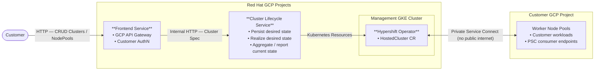

# Architecture Overview — GCP HCP

## What is GCP HCP?

GCP HCP (Hypershift on GCP) is a managed OpenShift service that runs customer control planes on Google Cloud. The control plane (API server, etcd, controllers) runs as pods on Red Hat–managed GKE clusters, not inside the customer's own infrastructure. This is the same pattern as ROSA HCP (AWS) and ARO HCP (Azure), applied to GCP.

## System Overview



**Key insight**: the control plane lives in Red Hat's GCP projects; the data plane (workers) lives in the customer's GCP project. PSC stitches them together privately.

> Full architecture reference: [Miro board](https://miro.com/app/board/uXjVJNpPkZ0=/)

## HCP vs Classic OpenShift

| | Classic OpenShift | HCP (Hosted Control Planes) |
|---|---|---|
| Control plane location | Customer cluster | Red Hat–managed GKE cluster |
| Worker nodes | Customer cluster | Customer GCP project |
| Upgrade unit | Full cluster | Control plane and workers independently |
| Density | 1 cluster = 1 control plane | Many control planes per management cluster |
| Platform | Full OpenShift cluster (control plane + workers on the same nodes) | GKE (management cluster) + RHCOS workers (customer project) |

## GCP Project Hierarchy

Infrastructure is organized **environment-first**, then by region:

```
GCP Organization
└── GCP HCP <Environment>/          ← integration | stage | production | development
    ├── <env>-global                ← global services (shared per environment)
    └── <region>/                   ← e.g. us-central1, europe-west1
        ├── <env>-<region>          ← regional cluster + regional infra
        └── <env>-<region>-mgmt-*  ← management clusters (one or more per region)
```

This structure gives clear promotion paths (int → stage → prod), strict environment isolation via folder-level IAM, and clean cost attribution.

See: [GCP Folder and Project Hierarchy](../design-decisions/gcp-folder-project-hierarchy.md)

## Regional Independence

Each region is fully self-contained — no cross-region network calls, no cross-region data dependencies. A failure in `us-central1` does not affect `europe-west1`. Multiple management clusters per region provide horizontal scale and limit blast radius within a region.

See: [Regional Independence Architecture](../design-decisions/regional-independence-architecture.md)

## Networking: Private Service Connect

Worker-to-control-plane traffic is never on the public internet. PSC provides private, isolated connectivity:

- **Service side**: Internal Load Balancer in the management cluster project exposes the control plane via a PSC attachment.
- **Customer side**: A PSC endpoint in the customer's VPC connects to the attachment.

No VPC peering, no IP conflicts between customers, full network isolation between tenants.

See: [Private Service Connect Networking](../design-decisions/private-service-connect-networking.md)

## Identity: Workload Identity

No long-lived service account keys anywhere. Every operator in the control plane uses **Workload Identity** to bind its Kubernetes ServiceAccount to a Google Service Account. Credentials rotate automatically; nothing is stored.

See: [Workload Identity Implementation](../design-decisions/workload-identity-implementation.md)

## Observability: Google Managed Prometheus (GMP)

Metrics architecture is hybrid:
- **Self-managed Prometheus** on each management cluster collects HCP component metrics (compatible with existing ServiceMonitors/PodMonitors).
- **GMP** receives the exported metrics for long-term storage, global querying, and alerting.

Regional data isolation is maintained — metrics stay in their home region project by default.

See: [Observability — Google Managed Prometheus](../design-decisions/observability-google-managed-prometheus.md)

## Operations: Zero Operator Access

No operator — human or AI agent — directly accesses production systems. All operational actions are mediated through Cloud Workflows with PAM (Privileged Access Manager) approval, fully audited, and time-bounded. The principle is applied in layers based on resource sensitivity:

- **Customer workloads and API** (Layer 1): aspirationally zero access; no legitimate operational reason to access customer pods, secrets, or cluster API.
- **Hosted control plane components** (Layer 2): zero unmediated access — all actions via Cloud Workflows + PAM approval, no direct `kubectl` or pod exec.
- **Platform infrastructure** (Layer 3): GitOps exclusively for normal operations (Terraform + ArgoCD); Cloud Workflows + PAM for incident response.
- **Observability data** (Layer 4): accessible to operators for diagnosis, with separation between platform telemetry and customer-originated data.

See: [Zero Operator Access](../design-decisions/zero-operator-access.md)

## Deployment Tooling: Two Swim Lanes

**Terraform** manages foundational GCP infrastructure (projects, VPCs, GKE clusters, IAM). **ArgoCD** manages everything deployed on clusters.

See: [Deployment Tooling Swim Lanes](../design-decisions/deployment-tooling-swim-lanes.md)


## Architectural Invariants

These constraints apply everywhere. Flag violations in code review.

1. **No direct cross-cluster connectivity** — coordination is async or via GCP APIs. PSC for worker → control plane is the only exception.
2. **Regional independence** — no cross-region network or data dependencies.
3. **Workload Identity for all auth** — no long-lived service account keys.
4. **GMP for observability** — no custom Prometheus deployments outside the hybrid GMP architecture.
5. **ArgoCD for all cluster workloads** — no direct `helm install` or `kubectl apply` in production.
6. **Terraform for GCP infrastructure** — no manual resource creation in production.

## Repository Map

| Repo | What lives there |
|------|-----------------|
| [gcp-hcp](https://github.com/openshift-online/gcp-hcp) | Design decisions, architecture docs, implementation plans |
| [hypershift](https://github.com/openshift/hypershift) | GCP platform implementation code |
| [gcp-hcp-infra](https://github.com/openshift-online/gcp-hcp-infra) | Terraform modules, ArgoCD configs |
| [gcp-hcp-ctl](https://github.com/openshift-online/gcp-hcp-ctl) | CLI tooling (new — ops commands, Hyperfleet-compatible) |
| [gcp-hcp-cli](https://github.com/apahim/gcp-hcp-cli) | CLI tooling (legacy — CLS stack) |
| [cls-backend](https://github.com/apahim/cls-backend) | Cluster Lifecycle Service backend |
| [cls-controller](https://github.com/apahim/cls-controller) | Cluster Lifecycle Service controller |

## Further Reading

All design decisions live in the [design-decisions/](../design-decisions/) folder — each file follows the same template (context, alternatives considered, decision rationale, consequences). Reading through them is the fastest way to understand *why* things are the way they are.

The [experiments/](../experiments/) folder contains PoCs, research, and architecture diagrams. The [studies/](../studies/) folder contains research and analysis that feeds into design decisions.

Key decisions for new hires to read first:
- [GKE as Container Platform](../design-decisions/gke-container-platform.md) — why GKE instead of OpenShift for management clusters
- [Regional Independence](../design-decisions/regional-independence-architecture.md) — the foundational topology decision
- [Private Service Connect](../design-decisions/private-service-connect-networking.md) — worker/control-plane networking
- [Workload Identity](../design-decisions/workload-identity-implementation.md) — how auth works
- [Deployment Tooling Swim Lanes](../design-decisions/deployment-tooling-swim-lanes.md) — Terraform vs ArgoCD boundary
- [Zero Operator Access](../design-decisions/zero-operator-access.md) — SRE access philosophy
