# AI-Assisted SDLC Workflow

This diagram illustrates the AI-assisted Software Development Lifecycle for GCP HCP ([GCP-594](https://issues.redhat.com/browse/GCP-594)), covering all 8 phases with artifact flow, human/AI involvement, and feedback loops.

Related: [GCP-579](https://issues.redhat.com/browse/GCP-579) (Agentic SDLC pilot), [GCP-630](https://issues.redhat.com/browse/GCP-630) (implementation tracking)

## Legend

| Style | Meaning |
|-------|---------|
| Green node | AI-assisted output — AI plays the primary role |
| Blue node | Human-gated output — human approval or decision required |
| Purple node | Mixed — both AI assistance and human involvement |
| Yellow node | External trigger / input artifact |
| Grey diamond | Decision point |

Feedback loops are marked with `⟳` on the edge label.

## Cross-Cutting Principles

The following principles apply across all phases but are not shown in the diagram:

- **Mandatory session retros** via lifecycle hooks after each phase
- **Progressive trust model** — human gates everywhere initially, removed as team confidence grows
- **Phased agent architecture** — each step maps to a specialized agent
- **AI for reasoning only** — deterministic tasks (builds, deploys, CI) use scripts, not AI

## Workflow Diagram

```mermaid
flowchart TD
    classDef ai       fill:#d4edda,stroke:#28a745,color:#155724
    classDef human    fill:#cce5ff,stroke:#0056b3,color:#004085
    classDef mixed    fill:#e2d9f3,stroke:#6f42c1,color:#491d7d
    classDef artifact fill:#fff3cd,stroke:#856404,color:#533f03
    classDef decision fill:#f8f9fa,stroke:#6c757d,color:#212529

    %% ─── Phase 1: Planning ────────────────────────────────────────────────────
    subgraph P1["Phase 1: Planning"]
        subgraph P1F["Feature Level"]
            NewReq[/"New Requirement"/]
            FeatNew["Feature Card (New)"]
            FeatTodo["Feature Card (To Do)"]
            NewReq -->|"PRD interview skill (AI-assisted)"| FeatNew
            FeatNew -->|"Eng/PM sign-offs + DoR checks"| FeatTodo
        end

        subgraph P1E["Epic Level"]
            EpicNew["Epic Cards (New)"]
            EpicRef["Epic Cards (Refinement)"]
            EpicTodo["Epic Cards (To Do)"]
            SpikeNew["Spike Cards (New)"]
            StoryNew["Story/Task Cards (New)"]
            EpicNew -->|"Team grooming"| EpicRef
            EpicRef -->|"Prioritization (AI dep/roadmap analysis)"| EpicTodo
            EpicTodo -->|"Determine spikes needed"| SpikeNew
            EpicTodo -->|"AI breakdown: epic + templates + impl details"| StoryNew
        end

        subgraph P1S["Story/Task Level"]
            StoryRef["Story/Task Cards (Refinement)"]
            StoryTodo["Story/Task Cards (To Do)"]
            StoryRef -->|"Wed backlog refinement (human checkpoint)"| StoryTodo
        end

        %% Cross-level edges within Planning
        FeatTodo -->|"AI template-based breakdown + estimation"| EpicNew
        StoryNew -->|"AI DoR + template adherence checks"| StoryRef
    end

    %% ─── Phase 2: Analysis & Design ──────────────────────────────────────────
    subgraph P2["Phase 2: Analysis & Design"]
        ImplPlan["Implementation Plans / Design Decisions"]
        SpikeDecision{"Spike changes breakdown?"}
        StoryUpd["Story/Task Cards (Updated)"]
        SpikeNew -->|"Research/execution (AI reference lookup)"| ImplPlan
        ImplPlan --> SpikeDecision
        SpikeDecision -->|"⟳ Yes: re-breakdown epic"| EpicNew
        SpikeDecision -->|"No: update stories with design context"| StoryUpd
    end

    %% ─── Phase 3: Coding ──────────────────────────────────────────────────────
    subgraph P3["Phase 3: Coding (tests included in same PR)"]
        StoryWip["Story/Task Card (In Progress)"]
        Branch["Git Branch"]
        CodeChanges["Code + Tests"]
        LocalReview["Local Review Feedback"]
        PR["PR (Ready for Review)"]
        StoryTodo -->|"Pick up card — feature lead drives lifecycle"| StoryWip
        StoryUpd  -->|"Pick up card"| StoryWip
        StoryWip -->|"Create feature branch"| Branch
        Branch -->|"Pair programming with Claude Code (AI-assisted)"| CodeChanges
        CodeChanges -->|"Pre-PR AI review: linting, simplification, PR toolkit"| LocalReview
        LocalReview -->|"Author self-review + open PR"| PR
    end

    %% ─── Phase 4: Review ──────────────────────────────────────────────────────
    subgraph P4["Phase 4: Review"]
        AIReview["Review Comments (AI)"]
        HumanReview["Review Comments (Human)"]
        PRUpdated["PR (Updated)"]
        Approved["PR (Approved)"]
        PR -->|"CodeRabbitAI + PR review toolkit (QA, security, SRE personas)"| AIReview
        PR -->|"Human review (required: every PR per RH policy)"| HumanReview
        AIReview -->|"address-reviews skill"| PRUpdated
        HumanReview -->|"Author addresses feedback"| PRUpdated
        PRUpdated -->|"Re-review cycle"| Approved
    end

    %% Feedback loop: Review → Coding
    PRUpdated -->|"⟳ Rejection: fix issues"| StoryWip

    %% ─── Phase 5: Testing ─────────────────────────────────────────────────────
    subgraph P5["Phase 5: Testing"]
        CIResults["CI Results"]
        CIGreen["PR (CI Green)"]
        FailDiag["Failure Diagnosis"]
        Approved -->|"CI pipeline: unit, integration, e2e"| CIResults
        CIResults -->|"Pass + 85% unit coverage check"| CIGreen
        CIResults -->|"Fail: CI triage skill"| FailDiag
    end

    %% Feedback loop: Testing → Coding
    FailDiag -->|"⟳ Fix issues"| StoryWip

    %% ─── Phase 6: Deployment ──────────────────────────────────────────────────
    subgraph P6["Phase 6: Deployment (progressive rollout)"]
        Main["Code in Main"]
        BuildArtifact["Build Artifact"]
        PilotDeploy["Pilot Deployment"]
        Production["Production (all regions)"]
        CIGreen -->|"Merge PR (human decision) — JIRA card → Closed"| Main
        Main -->|"CD pipeline triggers (deterministic, scripted)"| BuildArtifact
        BuildArtifact -->|"Deploy to pilot regions (human approval at boundary)"| PilotDeploy
        PilotDeploy -->|"Verified — deploy to all regions (approval + automated gates)"| Production
    end

    %% ─── Phase 7: Maintenance ─────────────────────────────────────────────────
    subgraph P7["Phase 7: Maintenance"]
        BugReport[/"Bug Report / Customer Issue"/]
        BugCard["JIRA Bug Card"]
        DepAlert[/"Dependency Alert (Dependabot)"/]
        DepUpdatePR["Dependency Update PR"]
        CleanupRec["Backlog Cleanup Recommendations"]
        ClosureNudge["Epic/Feature Closure Nudge"]
        BugReport -->|"AI triage + categorize (human severity assessment)"| BugCard
        DepAlert -->|"Automated PR creation (Dependabot)"| DepUpdatePR
        Production -->|"Periodic: AI scans for stale/duplicate cards"| CleanupRec
        Production -->|"All child stories closed: AI nudges assignee"| ClosureNudge
    end

    %% Dependency update PR re-enters the standard review + CI flow
    DepUpdatePR -->|"Human reviews changes"| PR

    %% Feedback loop: Maintenance → Coding
    BugCard -->|"⟳ Bug fix (AI backport assistance)"| StoryWip

    %% ─── Phase 8: Operations ──────────────────────────────────────────────────
    subgraph P8["Phase 8: Operations"]
        Dashboards["Dashboards (Vertex AI log analysis)"]
        Incident["Incident"]
        PostMortem["Post-mortem"]
        ActionItems["Action Items → JIRA Cards"]
        Production -->|"Monitor metrics/logs"| Dashboards
        Dashboards -->|"Alert fires — interrupt catcher (AI triage + KB lookup)"| Incident
        Incident -->|"Resolved — AI summarization"| PostMortem
        PostMortem -->|"Team review"| ActionItems
    end

    %% Feedback loop: Operations → Planning
    ActionItems -->|"⟳ New requirements"| NewReq

    %% ─── Node Styling ─────────────────────────────────────────────────────────
    class NewReq,BugReport,DepAlert artifact
    class FeatNew,EpicNew,StoryNew,StoryRef,ImplPlan,AIReview,LocalReview,FailDiag,CleanupRec,ClosureNudge,Dashboards ai
    class FeatTodo,EpicRef,EpicTodo,StoryTodo,HumanReview,Approved,Main,BuildArtifact,CIResults,CIGreen,PilotDeploy,Production,PostMortem,ActionItems human
    class SpikeNew,StoryWip,StoryUpd,Branch,CodeChanges,PR,PRUpdated,BugCard,DepUpdatePR,Incident mixed
    class SpikeDecision decision
```

## Feedback Loops Summary

| Loop | Trigger | Returns to |
|------|---------|-----------|
| Review → Coding | PR rejected by reviewer | Story/Task Card (In Progress) |
| Testing → Coding | CI failure | Story/Task Card (In Progress) |
| Maintenance → Coding | Bug fix needed | Story/Task Card (In Progress) |
| Operations → Planning | Incident action items | New Requirement |
| Analysis → Planning | Spike changes story scope | Epic Cards (New) re-breakdown |

## Testing Use Cases (Context)

Three testing scenarios run against the CI pipeline (Phase 5), not shown as separate diagram steps:

1. **E2E against candidate channel** — managed service validation
2. **Hypershift changes against managed service** — pre-production testing
3. **Upstream blocking tests in OCP** — prevent GCP breakage
