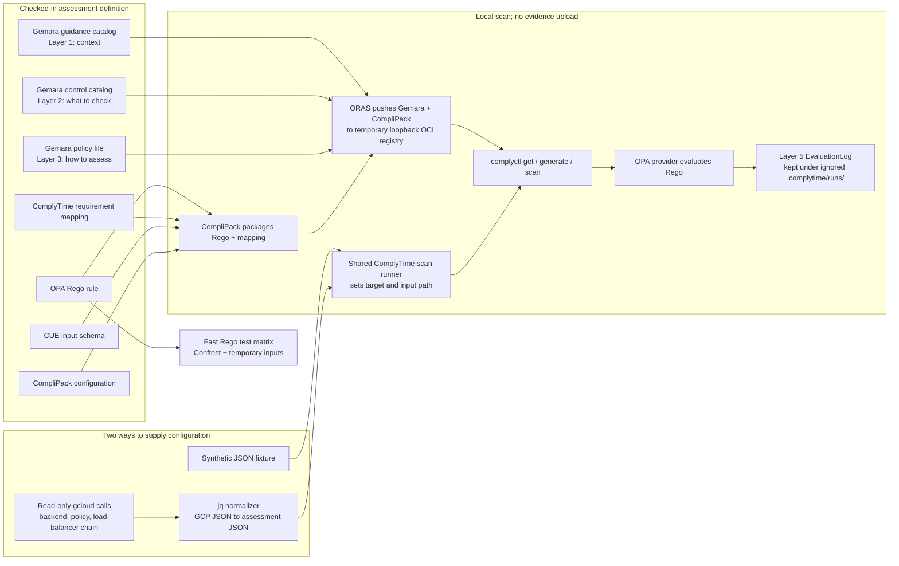

# ComplyTime evidence experiment

This is a small, local learning experiment for checking one Cloud Armor WAF configuration with Gemara, CompliPack, ComplyTime, and OPA. It is written for engineers who know how to operate services but may not work with audit and compliance concepts every day.

The prototype has two input paths: synthetic JSON for repeatable tests, and an explicitly requested, read-only `gcloud` scan of selected GCP resources. Both paths use the same assessment rule and local ComplyTime scan runner. A completed scan leaves a structured `EvaluationLog` on the machine; it does not upload evidence anywhere.

> **Status and limits:** This is a learning prototype, not a production collector or an approved interpretation of an internal control. Its example requirement ID is `EXAMPLE-WAF-POC-1`. A passing result checks a narrow set of configuration settings; it does not prove the WAF detects or blocks attacks.

## Start here

1. Read this overview to understand the pieces and the data flow.
2. Read the [Cloud Armor WAF runbook](controls/cloud-armor-waf/README.md) for prerequisites, exact commands, outputs, and privacy details.
3. Start with `make test` and `make scan-fixture`. These use synthetic inputs and do not contact a GCP project.
4. Only when you want to inspect real configuration, use `make scan-live` with a project, global backend service, and Cloud Armor policy that you are authorized to read. The live command is read-only, but its local report can contain infrastructure details.

Run Make commands from `experiments/complytime-evidence/controls/cloud-armor-waf/`. The scripts are local experiment glue, not a scheduled or deployed pipeline.

## Architecture and data flow



The diagram describes the current local prototype. In particular, the arrows stop at a local log: there is no S3/Evidence Locker upload, WIF setup, Hyperproof API, Sumo Logic forwarding, or scheduled job here. The direct Conftest test matrix is a fast policy check; it is separate from the native ComplyTime scans that produce `EvaluationLog` files.

### What the live scan actually reads

The live collector uses the currently active `gcloud` identity; it does not use WIF. It reads the explicitly named global backend service and Cloud Armor security policy, then follows the backend's URL-map → HTTP(S) proxy → external forwarding-rule references to decide whether an external frontend was found. It normalizes those responses into the same input shape used by the policy. The commands are read-only (`describe` and filtered `list` calls); the collector does not change GCP resources.

The policy looks for a matching Cloud Armor policy attached to the backend, at least one non-preview deny or rate-limit action, an external frontend, and backend request logging with a positive sample rate. “Policy enabled” in this prototype means the policy is attached and has an enforcing action; Cloud Armor has no single policy-level `enabled` switch used by this check.

These are configuration signals, not an attack simulation. They do not prove a rule matches a real attack, that a request was blocked, that DNS or client access works, that alerts reach Infosec/Splunk, or that rules are reviewed and updated on schedule. `Passed` means only that this selected backend met the example checks for this one scan.

## Files and what they do

All checked-in files for this control are under `controls/cloud-armor-waf/`:

```text
controls/cloud-armor-waf/
├── README.md                         Detailed setup, commands, outputs, and limits
├── Makefile                          Short entry points: install-tools, test, scans, clean
├── complypack.yaml                   Connects Gemara files, schema, policy, and fixture paths
├── gemara/
│   ├── guidance-catalog.yaml         Layer 1: example background and recommendations
│   ├── control-catalog.yaml          Layer 2: example control and testable requirement
│   └── policy.yaml                   Layer 3: declares that OPA performs the assessment
├── schema/
│   └── cloud-armor-assessment.cue     Shape expected for normalized assessment input
├── policy/
│   ├── cloud_armor_waf.rego           OPA rules that return pass/fail findings
│   └── complytime-mapping.json       Maps the example control ID to its requirement ID
├── scripts/
│   ├── run-complytime-scan.sh         Shared local packaging, scan, and EvaluationLog flow
│   ├── run-fixture-scans.sh           Runs one fixture pass and one derived fixture failure
│   ├── run-live-check.sh              Collects selected GCP config and invokes the shared runner
│   ├── normalize-gcloud-snapshot.jq   Converts GCP API JSON into the policy input shape
│   └── assert-evaluation-log.sh       Checks overall and requirement-level scan results
└── tests/
    ├── fixtures/
    │   └── active-preconfigured-waf.json  One synthetic passing baseline; no real project data
    ├── run-fixtures.sh                Fast Conftest matrix; creates pass/fail inputs temporarily
    ├── test-clean-scope.sh            Ensures make clean stays inside this control's ignored outputs
    ├── test-complytime-fixture.sh     Checks native ComplyTime fixture logs for Passed and Failed
    ├── test-evaluation-log.sh          Tests log assertions, malformed input, and yq variants
    ├── test-live-collector.sh          Uses fake gcloud responses; never contacts GCP
    └── test-normalizer.sh              Exercises GCP-response normalization with synthetic JSON
```

The locally installed tools go in ignored `bin/`. Tool caches, generated workspaces, runner diagnostics, and EvaluationLogs go under ignored `.complytime/`; they are not source files. The live collector's raw responses and normalized input are temporary and removed at the end of its run. A live EvaluationLog remains local and may contain resource identifiers, so review it before sharing and do not commit it.

## A practical learning sequence

From the WAF control directory:

```sh
make install-tools
make test
make scan-fixture
```

`make test` includes fast synthetic policy/normalizer/collector checks and a local ComplyTime fixture scan. The collector test substitutes fake `gcloud` and a stub scan runner, so the test suite does not inspect your cloud project. `make scan-fixture` uses the local OCI registry and the installed ComplyTime tools but still uses fixture data, not GCP.

When ready for a live, read-only check:

```sh
make scan-live \
  PROJECT=YOUR_PROJECT_ID \
  BACKEND_SERVICE=YOUR_GLOBAL_BACKEND_SERVICE \
  SECURITY_POLICY=YOUR_GLOBAL_CLOUD_ARMOR_POLICY
```

The `PROJECT`, backend service, and policy are explicit on purpose: the command does not search every project or every WAF. Check `gcloud auth list --filter=status:ACTIVE` first and make sure that identity should read the selected resources. Do not paste real project/resource identifiers or live logs into source files or public issue/PR text.

A completed scan exits successfully whether its assessment result is `Passed` or `Failed`; `Failed` is a valid finding, for example when request logging is off. A collection or scan error is different and exits with status 2. The detailed runbook explains where to find the local `EvaluationLog` and diagnostics.

`make clean` removes only this control's ignored `bin/` and `.complytime/` directories. A dedicated test checks that the clean target cannot be redirected outside the control directory.

## Terms in plain language

| Term in this prototype | SRE-friendly meaning |
| --- | --- |
| Control | A security expectation the organization wants to check. It is not necessarily a single GCP setting. |
| Assessment requirement | The smaller, testable statement this prototype evaluates. Here it is an example, not an approved ESS mapping. |
| Gemara | The format used to keep background guidance, the requirement, and the assessment plan in separate files. The “layers” are document roles, not network layers. |
| CompliPack | The packaging tool that bundles assessment inputs so ComplyTime can load them. |
| OPA / Rego | The policy engine and rule language used here to evaluate the normalized JSON. |
| ComplyTime / `complyctl` | The scan framework and its command-line tool; they load the package, run the provider, and produce a result log. |
| EvaluationLog | A structured record of one assessment run. In this experiment it is local output, not evidence delivered to an auditor or evidence store. |
| Fixture | Saved synthetic input that makes tests repeatable without cloud access. |
| Normalizer | The `jq` transformation that converts GCP API responses into the stable JSON shape expected by the policy. |
| OCI registry | A local, temporary endpoint used to pass packaged artifacts to ComplyTime. It is not the S3 evidence destination. |
| “Cloud Armor policy” vs. “Gemara policy” | The Cloud Armor policy is a GCP resource. `gemara/policy.yaml` is a file describing the assessment. They are different things with similar names. |
| WIF | Workload Identity Federation: keyless cloud authentication for automation. This prototype does not configure or use it. |

## Why the scripts are Bash

The Bash scripts are small local wrappers around `gcloud`, `jq`, `oras`, `complypack`, and `complyctl`; the live check does not invent GCP observations. They make it easier to learn and repeat this prototype, but they are not a decision that production collection should be Bash. This repository's [pipeline automation decision](../../design-decisions/automation/pipeline-automation-tooling.md) selects Tekton for general scheduled, event-driven, or on-demand platform workflows. This experiment does not yet define or deploy that automation.

## Useful references

- [Cloud Armor security policy overview](https://docs.cloud.google.com/armor/docs/security-policy-overview)
- [Cloud Armor per-request logging](https://docs.cloud.google.com/armor/docs/request-logging)
- [ComplyTime WAF control runbook](controls/cloud-armor-waf/README.md), including pinned tool versions and the longer reference list
- [ComplyTime CLI quick start](https://github.com/complytime/complyctl/blob/main/docs/QUICK_START.md)
- [CompliPack](https://github.com/complytime/complypack)
- [Gemara Control Catalog schema](https://gemara.openssf.org/schema/controlcatalog.html)
- [Gemara Guidance Catalog schema](https://gemara.openssf.org/schema/guidancecatalog.html)
- [Gemara Policy schema](https://gemara.openssf.org/schema/policy.html)
