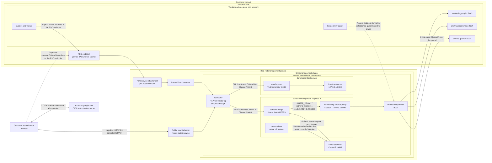
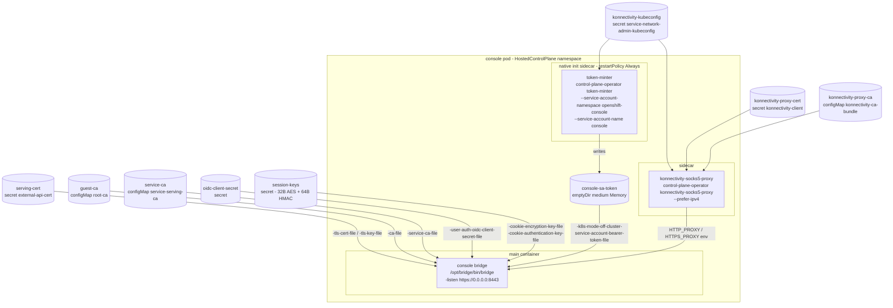
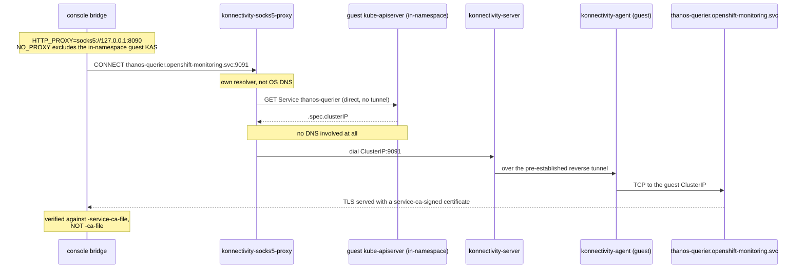
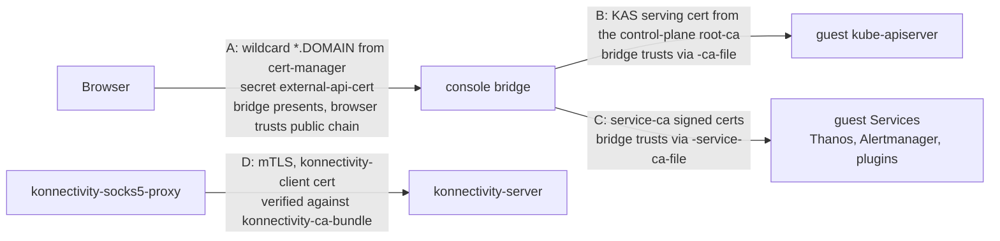
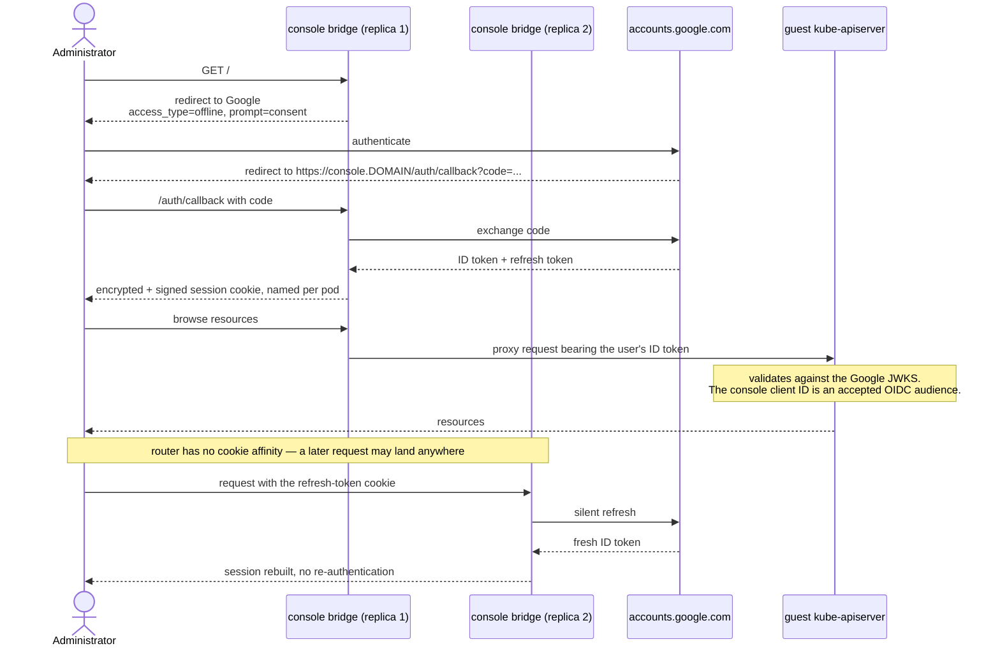
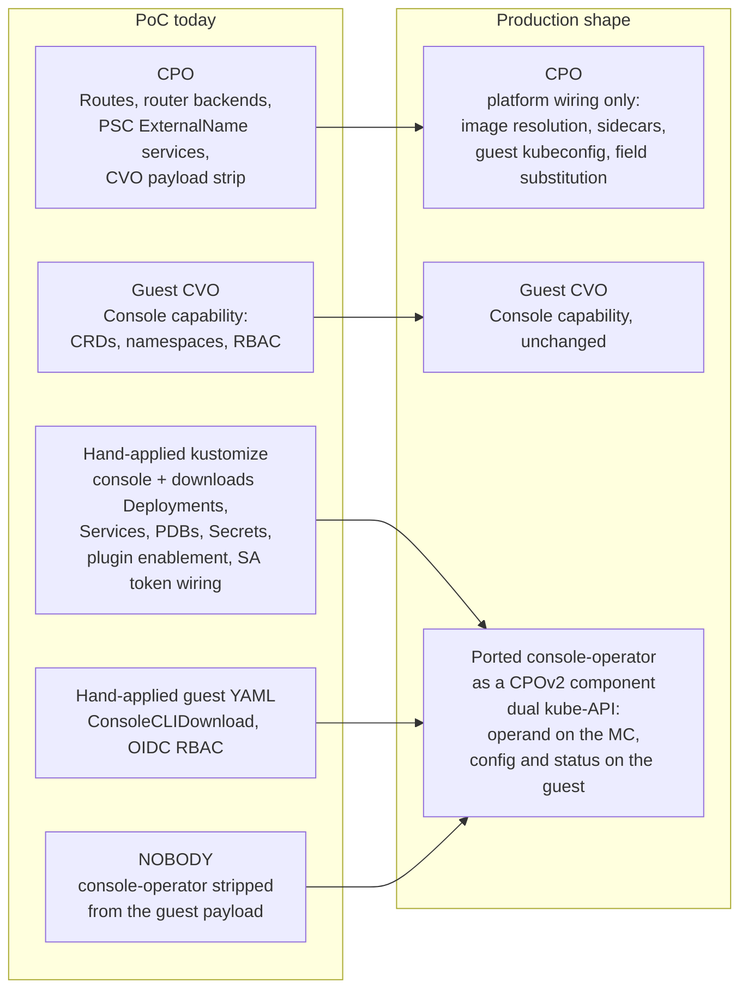

# Architecture: the console running control-plane-side

Reference diagrams for the GCP-1202 spike. Everything here describes what was
actually deployed and verified live on a GCP HostedCluster during the PoC — not
a target-state design. Where the production shape would differ, it is called
out explicitly.

For what was proven see [findings.md](findings.md); for the reconciliation gap
see [operator-migration.md](operator-migration.md).

Throughout, `DOMAIN` stands for the hosted cluster's domain — the same one that
carries `api.DOMAIN`. Console and downloads are siblings of the API hostname,
not of the guest ingress wildcard.

---

## 1. System topology

The single view: both GCP projects, both exposure modes, the console pod with
its sidecars, and every network path in and out.

Numbered paths:

| # | Path | Notes |
|---|---|---|
| 1a | Browser to public LB | `PublicAndPrivate` / `Public`. Records published by external-dns. |
| 1b | Browser to PSC endpoint | `Private`. CPO creates a `-private` Route labeled `route-visibility=private` plus an ExternalName Service; external-dns publishes an A record for `console.DOMAIN` to the PSC endpoint address inside the customer VPC. Reachable only from that VPC — during the PoC, through an SSH SOCKS bastion. |
| 2 | Browser to Google | Standard OIDC authorization-code flow. The bridge is a confidential client with its own client ID and secret. |
| 3 | Router to bridge | HAProxy `mode tcp`, SNI passthrough only. It never sees plaintext; the bridge terminates TLS itself. Backends are auto-registered from Routes carrying the HCP label, and dial `ClusterIP:8443` — which is why the console Service listens on 8443, not the upstream 443. |
| 4 | Bridge to guest kube-apiserver | **Direct, in-namespace, no tunnel.** This is the single most important structural fact: the guest KAS is an ordinary ClusterIP Service in the same namespace as the console pod, so the whole core console — resource browsing, the pod terminal — needs no konnectivity at all. `NO_PROXY` keeps this path out of the socks5 proxy. |
| 5 | token-minter to guest kube-apiserver | The bridge's *own* backend calls (dashboard ConfigMaps, plugin metrics) need a service-account identity, not the logged-in user's token. A native init sidecar running the CPO `token-minter` subcommand creates the guest `console` SA, mints a KAS-audience token into a memory-backed emptyDir, and refreshes it. |
| 6–8 | Bridge to guest Services | Only needed for things that live in the guest pod network: Thanos, Alertmanager, dynamic plugin backends. See [§4](#4-reaching-guest-services) and [reference/konnectivity-dns-resolution.md](reference/konnectivity-dns-resolution.md). |
| 7 | Konnectivity tunnel direction | The agent runs in the guest and dials *out* to the konnectivity server in the control plane. The control plane never initiates a connection into the customer VPC. |
| 9 | Worker to control plane | Unchanged by this work. Shown for context: workers reach `api.DOMAIN` through the same PSC endpoint and the same router. |

---

## 2. Console pod anatomy

Three containers, ten volumes. Every mount exists because something the
console-operator would normally inject has been hand-rolled instead.

Notable settings:

- `replicas: 2`, PDB `maxUnavailable: 1`. Multi-replica works only because of
  the OIDC refresh-token change in
  [openshift/console#17185](https://github.com/openshift/console/pull/17185) —
  the SNI-passthrough router cannot do cookie affinity, so any replica must be
  able to silently rebuild a session. The `POD_NAME` downward-API env var (which
  the operator normally injects at apply time, and which is therefore absent
  from the upstream static asset) is set here so each replica names its session
  cookie distinctly.
- `automountServiceAccountToken: false`. The bridge runs purely in off-cluster
  mode and needs no management-cluster identity.
- `priorityClassName: hypershift-control-plane`, and the guest master
  `nodeSelector`/`tolerations` removed — the pod now runs on the management
  cluster.
- Label `hypershift.openshift.io/request-serving-component: "true"`, required by
  the HCP router egress NetworkPolicy under Cilium on GKE.
- The upstream restricted-PSA `securityContext` is kept unmodified; the upstream
  console asset already complies with what HCP namespaces enforce.

The **downloads** operand is a separate Deployment: the stock upstream
download-server on `127.0.0.1:8080` plus an `oauth-proxy` sidecar terminating
TLS on 8443, because the router is passthrough-only and cannot perform the
upstream Route's edge termination. It uses the `cli-artifacts` image rather than
the console image, and needs a 6Gi ephemeral-storage request — GKE Autopilot's
1Gi default evicts it.

---

## 3. Exposure: public and private

```mermaid
flowchart TB
  subgraph PUB["PublicAndPrivate / Public"]
    B1["Browser, public internet"] --> LB["Public LB<br/>router-public service"]
    LB --> R1["hcp router<br/>SNI passthrough"]
    R1 --> S1["console Service :8443"]
    R1 --> S2["downloads Service :8443"]
    ED1["external-dns"] -. "A record console.DOMAIN to LB address" .-> LB
  end

  subgraph PRIV["Private"]
    B2["Browser, inside the customer VPC"] --> EP["PSC endpoint<br/>private IP"]
    EP --> SA2["PSC service attachment"]
    SA2 --> ILB2["Internal LB"]
    ILB2 --> R2["hcp router<br/>SNI passthrough"]
    R2 --> S3["console Service :8443"]
    R2 --> S4["downloads Service :8443"]
    XN["ExternalName Service<br/>created by CPO"] -. "read by" .-> ED2["external-dns"]
    ED2 -. "A record console.DOMAIN to PSC endpoint address" .-> EP
  end
```

The hostnames are derived by CPO from the APIServer host: `api.DOMAIN` implies
`console.DOMAIN` and `downloads.DOMAIN`. There is no separate ingress-domain
configuration, and the same wildcard certificate covers all three. Under
`Private`, CPO additionally reconciles `-private` Route variants labeled
`route-visibility=private` and the matching ExternalName Services.

Detail in [reference/private-endpoint-access.md](reference/private-endpoint-access.md).

> Operational wart observed during the PoC: the router configuration is not
> hot-reloaded, so a manual router restart was needed after applying a new
> Route. Benign, but it should be fixed before this is productized.

---

## 4. Reaching guest services

The core console needs nothing here. Monitoring and dynamic plugins do, because
Thanos, Alertmanager and plugin backends are ClusterIP Services that exist only
inside the guest pod network.

The resolver in the sidecar tries, in order: a cloud-API bypass (disabled here),
a Service-object lookup against the guest kube-apiserver reading
`.spec.clusterIP` (the path actually used), guest CoreDNS over the tunnel (only
with `--resolve-from-guest-cluster-dns`, which turned out not to be needed), and
finally the default Go resolver.

This path also has a hard prerequisite that bit the PoC: cross-node pod
networking in the guest must work. GCP's implied-deny was dropping
OVN-Kubernetes geneve UDP/6081 between worker nodes, which broke konnectivity
and everything riding on it. Fixed by a firewall rule, productized in
[openshift/hypershift#9640](https://github.com/openshift/hypershift/pull/9640)
(GCP-1221).

---

## 5. Certificates and trust

Four distinct trust relationships. Conflating any two of them is the single
most common way to get a confusing TLS failure here, and it is exactly what
[openshift/console#17185](https://github.com/openshift/console/pull/17185)
untangles.

| | Hop | Server presents | Client trusts via |
|---|---|---|---|
| A | Browser to bridge | cert-manager wildcard `*.DOMAIN`, the same `external-api-cert` secret the API server uses for its named certificate | Public chain |
| B | Bridge to guest KAS | Guest KAS serving certificate, issued by the control-plane `root-ca` | `-ca-file` pointing at the `root-ca` ConfigMap |
| C | Bridge to guest Services | service-ca-signed certificates | `-service-ca-file` pointing at the HCP-namespace `service-serving-ca` ConfigMap, which holds the guest service CA |
| D | socks5 sidecar to konnectivity-server | konnectivity server certificate | `konnectivity-client` certificate and `konnectivity-ca-bundle`, mTLS |

Two consequences worth stating plainly:

1. **Reusing the API wildcard for the console removes a whole class of
   guest-side certificate configuration.** Console, downloads and the API are
   all covered by one certificate whose lifecycle is entirely on the management
   side. This is one of the main non-obvious benefits of the move.
2. **There is no service-ca operator on the management cluster (GKE).** The
   upstream `service.beta.openshift.io/serving-cert-secret-name` annotation on
   the console Service is therefore removed; nothing would act on it.

> Note on the wildcard: self-signed is the HyperShift *default* for the hosted
> cluster API certificate, which is what the repository's design decision
> records. GCP HCP overrides it, supplying a Let's Encrypt-signed wildcard
> `*.<domain>` from a cert-manager `ClusterIssuer` and wiring it in through
> `apiServer.servingCerts.namedCertificates`. That wildcard already covered
> `api.<domain>` and `oauth.<domain>`; console and downloads come along for free
> because they reuse the same hostname pattern. See
> [open-questions.md](open-questions.md) §5.

---

## 6. Authentication flow

Two PoC-specific notes:

- `oidcProviders[].oidcClients[]` on the HostedCluster is **not admissible**
  without a running console-operator, because it requires a matching
  `status.oidcClients` entry that only the operator writes. The PoC therefore
  added the console client ID to the guest kube-apiserver's OIDC **audiences**
  and passed the client configuration to the bridge as flags.
- `access_type=offline` plus `prompt=consent` is required because Google does
  not honour the standard `offline_access` scope. Without a refresh token,
  sessions are pod-local and two replicas produce a re-authentication loop.

Detail in [reference/console-auth-options.md](reference/console-auth-options.md).

---

## 7. Who reconciles what

The PoC's weakest point, stated honestly. Today a large amount of what the
console-operator normally owns is hand-applied YAML.

The gap between these two columns is the bulk of the remaining engineering
cost, and it is scoped in [operator-migration.md](operator-migration.md).

---

## Related

- [findings.md](findings.md) — what was proven, by phase
- [operator-migration.md](operator-migration.md) — the console-operator dual-API refactor
- [open-questions.md](open-questions.md) — blockers and unresolved design questions
- [upstream-changes.md](upstream-changes.md) — every code change, with PR state
- [manifests/](manifests/) — the scrubbed manifests behind these diagrams
