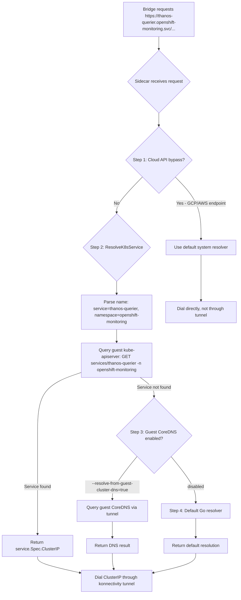
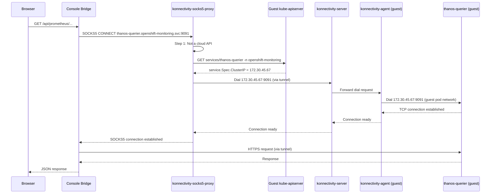

# Konnectivity DNS Resolution for Guest Service Access

How the control-plane-side console pod resolves and reaches guest-cluster Services (Thanos, Alertmanager, dynamic plugin backends) that exist only in the guest pod network. This mechanism is critical for monitoring, pod terminal, and dynamic plugin functionality.

## The Problem

A console pod running on the management cluster faces two challenges when accessing guest-cluster resources:

1. **Name resolution:** Guest Service names like `thanos-querier.openshift-monitoring.svc` or `monitoring-plugin.openshift-monitoring.svc.cluster.local` exist only in the **guest cluster's DNS**, not in the management cluster's DNS.
2. **Network reachability:** Even if resolved, guest ClusterIPs are routable only on the **guest pod network**, which the management-cluster pod cannot reach directly.

The konnectivity socks5 proxy sidecar solves both problems simultaneously.

## The Setup

The console pod includes a **`konnectivity-socks5-proxy` sidecar** that runs alongside the bridge container:

- The sidecar listens on `127.0.0.1:8090` as a SOCKS5 proxy.
- The bridge is configured via environment variables:
  ```
  HTTP_PROXY=socks5://127.0.0.1:8090
  HTTPS_PROXY=socks5://127.0.0.1:8090
  NO_PROXY=kube-apiserver.<hcp-namespace>.svc,localhost,127.0.0.1
  ```
- The `NO_PROXY` list excludes the in-namespace guest kube-apiserver Service and localhost, so KAS traffic stays direct and does not enter the tunnel.

Every upstream HTTP(S) request from the bridge (except `NO_PROXY` entries) is handed to the sidecar for resolution and proxying.

## The Resolution Chain

The konnectivity socks5 sidecar runs its **own custom resolver** rather than using the pod's OS DNS resolver. When the bridge requests a connection to a hostname, the sidecar resolves it through a **4-step fallback chain**:



### Step 1: Cloud API Bypass (Disabled for Console)

If the hostname is a cloud-provider API endpoint (GCP, AWS) **or** the resolver is disabled, use the default system resolver and do **not** tunnel the connection.

**Relevance:** This step keeps cloud API traffic on the management network. For the console, cloud API calls are rare, and this path is mostly a no-op.

### Step 2: ResolveK8sService (Primary Path)

**This is the workhorse mechanism.** The sidecar attempts to resolve the hostname as a Kubernetes Service by querying the **guest kube-apiserver** directly — **no DNS server is involved**.

**Implementation** (`support/konnectivityproxy/resolver.go:216`):

1. Parse the hostname into `Name` and `Namespace`:
   - `thanos-querier.openshift-monitoring.svc` → `Name=thanos-querier`, `Namespace=openshift-monitoring`
   - Standard `svc.cluster.local` suffixes are stripped.
2. Issue a Kubernetes `GET service` API call against the **guest kube-apiserver** using the sidecar's guest kubeconfig.
3. If the Service exists, return `service.Spec.ClusterIP`.
4. If the Service does not exist or the API call fails, fall through to step 3.

**Why this works:** Every Kubernetes ClusterIP Service has a stable `.spec.clusterIP` field that can be read directly from the API. DNS is merely a convenience layer on top of this — the sidecar bypasses DNS and reads the authoritative source.

**Consequence:** For plain ClusterIP Services (Thanos, Alertmanager, plugin backends), **step 2 alone is sufficient**. No DNS server query is needed.

### Step 3: Guest CoreDNS Over the Tunnel (Optional)

Only if step 2 fails **and** the sidecar is started with `--resolve-from-guest-cluster-dns` enabled.

**Implementation** (`support/konnectivityproxy/resolver.go:59`):

1. Query the guest cluster's `dns-default` Service in the `openshift-dns` namespace to obtain the CoreDNS ClusterIP.
2. Build a `net.Resolver` whose `Dial` function opens a connection **through the konnectivity tunnel** to `<CoreDNS-ClusterIP>:53` over TCP.
3. Issue a real DNS query to the guest cluster's CoreDNS.
4. The DNS packet path is: bridge → socks5 sidecar → konnectivity-server → reverse tunnel → konnectivity-agent (data plane) → guest CoreDNS.

**When this is needed:** Headless Services, SRV records, custom DNS entries, or any non-Service name. For the console's typical use cases (plugin backends, monitoring), step 2 already succeeds, so step 3 is rarely invoked.

**Health and fallback:** The sidecar includes health-check logic (`konnectivityHealth`) to detect when the konnectivity tunnel is down. If the tunnel is unhealthy and the optional management-cluster fallback is enabled, the resolver falls back to step 4.

### Step 4: Default Go Resolver (Last Resort)

If all previous steps fail, use the default Go `net.Resolver`, which queries the **management cluster's** DNS and returns a management-cluster-reachable IP.

**Relevance:** This is a last-resort fallback for management-cluster or external hostnames. For guest Service names, this step typically fails (the name does not exist in management-cluster DNS).

## Dialing After Resolution

Once the sidecar obtains a guest ClusterIP (from step 2 or 3), it opens a TCP connection **through the konnectivity tunnel**:

- The SOCKS5 protocol hands the resolved IP to the konnectivity-server.
- konnectivity-server forwards the dial request through the reverse tunnel to a konnectivity-agent running in the guest cluster.
- konnectivity-agent establishes the connection to the ClusterIP on the guest pod network.
- Data flows bidirectionally: bridge ↔ sidecar ↔ konnectivity-server ↔ konnectivity-agent ↔ guest Service.

**Result:** The otherwise-unroutable guest ClusterIP becomes reachable from the management-cluster console pod.

## Trust Domains and Certificate Authority Handling

The console pod operates across **two trust domains**:

1. **Guest kube-apiserver:** Presents a certificate signed by the control-plane `root-ca`.
2. **Guest Services:** Thanos, Alertmanager, plugin backends present certificates signed by the OpenShift `service-ca` (a different signer).

A single CA bundle cannot validate both certificate chains.

### The Split CA Configuration

The bridge requires **two separate CA files**:

- **`-ca-file`**: Trust bundle for the guest kube-apiserver path (control-plane `root-ca`).
- **`-service-ca-file`**: Trust bundle for service proxies (service-ca signer).

Without `-service-ca-file`, the bridge can reach the guest KAS but fails to validate TLS connections to guest Services, resulting in `x509: certificate signed by unknown authority` errors.

**Fix:** openshift/console PR #17185 added the `-service-ca-file` flag and updated the plugin asset transport and service proxy paths to use it.

**Mounting:** The control-plane-side console pod must mount both:
- The control-plane `root-ca` ConfigMap for `-ca-file`.
- The guest `service-ca-bundle` ConfigMap (synced from the guest by the operator or CPO) for `-service-ca-file`.

## Configuration Requirements

For the konnectivity DNS resolution mechanism to work, the following must be in place:

1. **Sidecar container:** A `konnectivity-socks5-proxy` sidecar in the console pod.
2. **Guest kubeconfig:** The sidecar must have a kubeconfig for the guest cluster (to perform step 2 Service lookups). In the PoC this is the HCP namespace's `service-network-admin-kubeconfig` Secret, mounted into the sidecar. It is **not** what the bridge uses — the bridge authenticates to the guest API with a bearer-token file minted by the `token-minter` sidecar.
3. **Proxy environment variables:** Set on the bridge container:
   ```
   HTTP_PROXY=socks5://127.0.0.1:8090
   HTTPS_PROXY=socks5://127.0.0.1:8090
   NO_PROXY=kube-apiserver.<hcp-namespace>.svc,localhost,127.0.0.1
   ```
4. **CA bundles:** Both `-ca-file` (for KAS) and `-service-ca-file` (for Services) must be provided to the bridge.
5. **Plugin asset transport:** The bridge's plugin-asset HTTP client must respect `HTTP_PROXY` (added in PR #17185). Otherwise, dynamic plugin assets and i18n resources cannot be fetched through the tunnel.

## When `--resolve-from-guest-cluster-dns` is NOT Needed

For the console's typical use cases:

- **Monitoring:** Thanos (`thanos-querier.openshift-monitoring.svc`) and Alertmanager (`alertmanager-main.openshift-monitoring.svc`) are standard ClusterIP Services → resolved by step 2.
- **Dynamic plugins:** Plugin backends (e.g., `monitoring-plugin.openshift-monitoring.svc`) are ClusterIP Services → resolved by step 2.
- **Pod terminal:** WebSocket connections to `/api/kubernetes/.../pods/<pod>/exec` go through the guest KAS, not konnectivity → not affected.

**Conclusion:** The PoC did **not** need `--resolve-from-guest-cluster-dns` because all targets were plain Services resolved at step 2.

Enable `--resolve-from-guest-cluster-dns` only if the console must reach:
- Headless Services (no ClusterIP).
- SRV records or custom DNS entries in the guest cluster.

## Prerequisite: Cross-Node Pod Networking in the Guest

The konnectivity tunnel relies on the guest cluster's pod network functioning correctly. Specifically, konnectivity-agents run on guest worker nodes, and the konnectivity-server (running on the control plane) must reach any agent to relay traffic.

**PoC Issue:** On GCP, the default VPC firewall rules included an **implied deny-all ingress** policy that dropped OVN-Kubernetes geneve traffic (UDP port 6081) between worker nodes. This broke all cross-node pod networking, including konnectivity.

**Symptom:** `504 Gateway Timeout` when the bridge attempted to reach guest Services, even though the Service names resolved correctly.

**Fix:** A firewall rule allowing ingress UDP 6081 between worker nodes:

```bash
gcloud compute firewall-rules create <infraID>-allow-geneve \
  --network=<network> \
  --action=ALLOW \
  --rules=udp:6081 \
  --source-tags=<infraID>-worker \
  --target-tags=<infraID>-worker
```

**Productization:** CPO now owns this firewall rule reconciliation (GCP-1221, openshift/hypershift#9640).

## Resolution and Dial Flow Diagram



## Summary

The konnectivity DNS resolution mechanism enables the control-plane-side console to reach guest Services transparently:

- **Step 2 (ResolveK8sService)** is the primary path and handles all standard ClusterIP Services by querying the guest kube-apiserver directly — no DNS server involved.
- **Step 3 (guest CoreDNS)** is optional and handles headless Services or custom DNS records.
- The sidecar dials resolved ClusterIPs through the konnectivity tunnel, making guest pod-network-only resources reachable from the management cluster.
- Two separate CA files (`-ca-file` for KAS, `-service-ca-file` for Services) are required to validate certificates across the two trust domains.
- Cross-node pod networking in the guest (OVN geneve UDP 6081) is a hard prerequisite.

For detailed architecture context, see [`../architecture.md`](../architecture.md). For OIDC and authentication details, see [`console-auth-options.md`](console-auth-options.md).
