# Private Endpoint Access for Console and Downloads

How the control-plane-side console and CLI-downloads server are exposed under each GCP `endpointAccess` mode (Public, PublicAndPrivate, Private), including the hostname model, DNS mechanics, router configuration, and browser access patterns.

## Hostname Model

The console and downloads hostnames follow the same domain pattern as the API server:

- **API:** `api.<domain>`
- **OAuth:** `oauth.<domain>`
- **Console:** `console.<domain>`
- **Downloads:** `downloads.<domain>`

The console hostname is **derived automatically** by CPO from the APIServer host (swapping the first DNS label: `api.<domain>` → `console.<domain>`). There is no separate ingress-domain configuration.

### TLS Certificates

All hostnames share the same **wildcard certificate** (`*.<domain>`) issued by cert-manager and referenced via `spec.configuration.apiServer.servingCerts.namedCertificates`. The console and downloads Services mount this same cert Secret and terminate TLS themselves (the HCP router is SNI passthrough, not TLS-terminating).

**Consequence:** No additional certificate resources are needed for console or downloads. The existing API wildcard already covers them.

## Public and PublicAndPrivate Modes

In these modes, the console and downloads are exposed via the **public load balancer** that fronts the HCP HAProxy router.

### Exposure Mechanics

1. **Route objects:** CPO reconciles a `console` Route and a `downloads` Route (both unlabeled or labeled for public visibility).
   - Host: `console.<domain>` and `downloads.<domain>`
   - Target Service: `console.<hcp-namespace>.svc` and `downloads.<hcp-namespace>.svc` (the Services live in the HostedControlPlane namespace, not `openshift-console`)
   - TLS: passthrough (the router does not terminate TLS)
   - Backend port: 8443

2. **Router backends:** The HCP HAProxy router (`app: private-router`) runs in `mode tcp` and performs SNI passthrough. It automatically registers backends for any Route labeled with the HCP route label. For console and downloads, the router configuration maps:
   - SNI hostname `console.<domain>` → backend `console.<hcp-namespace>.svc:8443`
   - SNI hostname `downloads.<domain>` → backend `downloads.<hcp-namespace>.svc:8443`

3. **DNS:** external-dns (running in the `hypershift` namespace) watches Routes and publishes A records for `console.<domain>` and `downloads.<domain>` pointing to the **public load balancer IP**.

4. **Data path:**
   ```
   Browser → Public LB :443 → HCP HAProxy router (SNI passthrough)
           → console Service (ClusterIP) :8443 → console pod (terminates TLS)
   ```

### Port 8443 Requirement

The console Service listens on port **8443** (not the upstream default 443) because the CPO router backend configuration dials the ClusterIP on port 8443 directly. This is consistent with other HCP services that terminate their own TLS behind the passthrough router.

## Private Mode

In Private mode, the public load balancer is torn down. All traffic reaches the HCP via a **Private Service Connect (PSC) endpoint** inside the customer VPC, reachable only from within that VPC (or peered/VPN networks).

### What Changes vs Public

- **No public LB:** The cloud LoadBalancer resource is deleted.
- **PSC endpoint:** A PSC endpoint is provisioned in the customer VPC (e.g., IP `10.0.0.5` in the customer's subnet).
- **DNS repointing:** The public DNS A records for `console.<domain>` and `downloads.<domain>` are updated to point to the **PSC endpoint IP** instead of the public LB IP.
- **Browser access:** Users must be **inside the customer VPC** (or on a connected network) to resolve and reach the PSC IP.

### How DNS Repointing Works

external-dns uses a **label-based filter** to decide what to publish:

- It is configured with `--label-filter=hypershift.openshift.io/route-visibility!=private`, meaning it **ignores Routes labeled `route-visibility=private`**.
- Instead, external-dns sources the DNS record from a **ExternalName Service** annotated with `external-dns.alpha.kubernetes.io/hostname=<host>` and pointing at the PSC endpoint IP.

For each user-facing hostname under Private mode, CPO creates two objects:

1. **A Route labeled `route-visibility=private`** (external-dns ignores it) — this Route is what the HCP HAProxy router consumes to build its SNI backend.
2. **An ExternalName Service** (`<name>-private-external`, with `externalName: <PSC-endpoint-IP>` and hostname annotation) — this is what external-dns publishes as the A record.

### CPO Reconciliation for Console and Downloads

CPO reconciles the console and downloads exposure Routes using the same public/private pattern as the API and OAuth servers:

**Public / PublicAndPrivate:**
- Route name: `console` (no visibility label)
- external-dns publishes `console.<domain>` → public LB IP

**Private:**
- Route name: `console-private` (labeled `route-visibility=private` and `internal-route=true`)
- ExternalName Service: `console-private-external` (externalName: `<PSC-IP>`, hostname annotation: `console.<domain>`)
- external-dns publishes `console.<domain>` → PSC endpoint IP

The same pattern applies to `downloads` / `downloads-private`.

### Example: Private Mode DNS and Routing

For a HostedCluster with `endpointAccess: Private` and domain `console-demo-a1b2.us-c1-e5d4c3-1.dev.gcp-hcp.openshiftapps.com`:

**PSC endpoint IP:** `10.0.0.5` (inside the customer VPC)

**DNS records (inside the customer VPC):**
```
console.console-demo-a1b2.us-c1-e5d4c3-1.dev.gcp-hcp.openshiftapps.com  → 10.0.0.5
downloads.console-demo-a1b2.us-c1-e5d4c3-1.dev.gcp-hcp.openshiftapps.com → 10.0.0.5
api.console-demo-a1b2.us-c1-e5d4c3-1.dev.gcp-hcp.openshiftapps.com      → 10.0.0.5
```

All hostnames resolve to the same PSC IP. The HCP router performs SNI-based routing to the correct backend Service.

**Kubernetes objects (in the HCP namespace):**
- Route: `console-private` (host: `console.<domain>`, labeled `route-visibility=private`)
- Service: `console-private-external` (type: ExternalName, externalName: `10.0.0.5`, annotation: `external-dns.alpha.kubernetes.io/hostname=console.<domain>`)
- Service: `console` (type: ClusterIP, port: 8443)

## Router Configuration

The HCP HAProxy router (`v2/router/deployment.go`, `v2/router/config.go`) runs in `mode tcp` and performs **SNI passthrough**:

- Backends are auto-registered from Routes carrying the HCP route label.
- The router reads the SNI hostname from the TLS ClientHello and forwards the connection (with the TLS handshake intact) to the corresponding backend Service.
- The backend Service (console or downloads pod) terminates TLS itself.

### Backend Registration

The router configuration generator (`v2/router/config.go`) maps both the public and `-private` Route names to the same backend Service and port:

- Route `console` or `console-private` → backend `console.openshift-console.svc:8443`
- Route `downloads` or `downloads-private` → backend `downloads.openshift-console.svc:8443`

This allows CPO to toggle between public and private exposure modes by swapping Route objects without changing the router backend configuration.

### Operational Wart: Router Configuration Not Hot-Reloaded

**Known limitation:** The router's HAProxy configuration is not automatically reloaded when a new Route is applied. After creating or updating the console or downloads Route, a **manual router pod restart** is required for the new backend to take effect.

**Symptom:** Applying a new Route results in `503 Service Unavailable` or connection timeouts until the router pod is restarted.

**Workaround:**
```bash
kubectl delete pod -n <hcp-namespace> -l app=private-router
```

**Future work:** Implement hot-reload of the router configuration (e.g., via inotify or periodic reconciliation).

## Browser Access to Private Endpoints

Private endpoints resolve and route only **inside the customer VPC**. To access the console or downloads from a browser, the user must be on a network that can reach the PSC endpoint IP.

### SSH SOCKS Bastion (PoC Pattern)

During the PoC, private endpoints were accessed through a **bastion VM** inside the customer VPC using an **SSH SOCKS5 tunnel**. This pattern preserves TLS/SNI end-to-end and requires no additional software on the bastion VM.

#### Bastion Setup

1. Create a small VM inside the customer VPC:
   ```bash
   gcloud compute instances create console-bastion \
     --zone=<zone> \
     --machine-type=e2-micro \
     --network=<customer-vpc> \
     --subnet=<customer-subnet> \
     --tags=console-bastion
   ```

2. Create a firewall rule to allow SSH:
   ```bash
   gcloud compute firewall-rules create allow-ssh-to-bastion \
     --network=<customer-vpc> \
     --action=ALLOW \
     --rules=tcp:22 \
     --source-ranges=0.0.0.0/0 \
     --target-tags=console-bastion
   ```
   (For production, restrict `--source-ranges` to your egress IP.)

3. Verify DNS resolution from the bastion:
   ```bash
   $ getent hosts console.<domain>
   10.0.0.5       console.<domain>
   ```

#### Browser Configuration

1. Open an SSH SOCKS tunnel:
   ```bash
   gcloud compute ssh console-bastion --zone=<zone> -- -D 1080 -N
   ```
   This creates a SOCKS5 proxy on `localhost:1080` that forwards all traffic through the bastion VM.

2. Configure the browser (e.g., Firefox):
   - Settings → Network Settings → Manual proxy configuration
   - SOCKS Host: `127.0.0.1`, Port: `1080`, **SOCKS v5**
   - **Enable "Proxy DNS when using SOCKS v5"** (critical — DNS must resolve at the bastion, not the local machine)
   - Tip: Use FoxyProxy or a dedicated Firefox profile to scope the proxy to `*.<domain>` instead of proxying all traffic.

3. Browse:
   ```
   https://console.<domain>
   https://downloads.<domain>
   ```

#### In-Bastion Validation

From inside the bastion VM, verify the private path works:

```bash
$ curl --head https://console.<domain>/health
HTTP/2 200
$ curl --head https://downloads.<domain>/
HTTP/2 200
```

The TLS certificate should validate (wildcard cert issued by Let's Encrypt or the configured cert-manager issuer).

### Usability Consideration

The SSH SOCKS bastion pattern is functional but **not user-friendly** for end-users. Private clusters are intended for enterprise environments where:

- Users connect via corporate VPN or Direct Connect / Cloud Interconnect.
- The customer VPC is peered with an office network.
- Users access the console from jump hosts or cloud-based workstations inside the VPC.

The bastion pattern is a **testing and troubleshooting tool**, not a replacement for production VPN/VPC connectivity.

## Exposure Topology Diagram

```mermaid
flowchart TD
    subgraph Public["Public / PublicAndPrivate Mode"]
        Browser1[Browser] -->|HTTPS| PublicLB[Public Load Balancer]
        PublicLB -->|SNI passthrough| Router1[HCP HAProxy Router]
        Router1 -->|TLS passthrough| ConsoleSvc1[console Service :8443]
        ConsoleSvc1 --> ConsolePod1[console Pod terminates TLS]
        
        DNS1[external-dns] -->|Publishes A record| PublicDNS[console.domain → Public LB IP]
        Route1[Route: console] -.->|watched by| DNS1
        Route1 -.->|backend config| Router1
    end
    
    subgraph Private["Private Mode"]
        Browser2[Browser inside VPC] -->|HTTPS| PSC[PSC Endpoint 10.0.0.5]
        PSC -->|SNI passthrough| Router2[HCP HAProxy Router]
        Router2 -->|TLS passthrough| ConsoleSvc2[console Service :8443]
        ConsoleSvc2 --> ConsolePod2[console Pod terminates TLS]
        
        DNS2[external-dns] -->|Publishes A record| PrivateDNS[console.domain → PSC IP]
        Route2[Route: console-private\nlabel: route-visibility=private] -.->|backend config| Router2
        ExtSvc[ExternalName Service\nconsole-private-external] -.->|watched by| DNS2
    end
    
    classDef publicClass fill:#e1f5ff,stroke:#0066cc
    classDef privateClass fill:#ffe1e1,stroke:#cc0000
    class Browser1,PublicLB,Router1,ConsoleSvc1,ConsolePod1,DNS1,PublicDNS,Route1 publicClass
    class Browser2,PSC,Router2,ConsoleSvc2,ConsolePod2,DNS2,PrivateDNS,Route2,ExtSvc privateClass
```



## Implementation References

CPO code paths for console and downloads exposure (all paths relative to `openshift/hypershift`):

- **Route reconciliation:** `control-plane-operator/controllers/hostedcontrolplane/console/route.go`
  - Host derivation: swap first label of APIServer host
  - Public vs private Route creation based on `IsPublicHCP`
- **Infra controller:** `control-plane-operator/controllers/hostedcontrolplane/infra/infra.go`
  - `reconcileConsoleRoutes` (GCP-gated, called from main reconcile loop)
- **Route manifests:** `control-plane-operator/controllers/hostedcontrolplane/manifests/ingress.go`
  - `ConsoleRoute`, `ConsolePrivateRoute`, `DownloadsRoute`, `DownloadsPrivateRoute`
- **ExternalName Services:** `control-plane-operator/controllers/hostedcontrolplane/manifests/infra.go`
  - `ConsoleExternalPrivateService`, `DownloadsExternalPrivateService`
- **PSC endpoint controller:** `control-plane-operator/controllers/gcpprivateserviceconnect/psc_endpoint_controller.go`
  - Creates ExternalName Services for console and downloads under Private mode
- **Router backend config:** `control-plane-operator/controllers/hostedcontrolplane/v2/router/config.go`
  - Maps both public and `-private` Route names to the same backend Service:port

Kustomize manifests (PoC-specific):

- `manifests/console/kustomize/` contains the console Deployment, Service, and session Secrets.
- The upstream console and downloads Route manifests are **deleted** via `$patch: delete` because CPO owns them.

## Summary

| Aspect | Public / PublicAndPrivate | Private |
|--------|--------------------------|---------|
| **Load balancer** | Public cloud LB | PSC endpoint in customer VPC |
| **DNS target** | Public LB IP | PSC endpoint IP (e.g., `10.0.0.5`) |
| **Route object** | `console`, `downloads` (no label) | `console-private`, `downloads-private` (labeled `route-visibility=private`) |
| **ExternalName Service** | None | `console-private-external`, `downloads-private-external` |
| **Browser access** | Anywhere on the Internet | Inside customer VPC only |
| **TLS termination** | console pod (port 8443) | console pod (port 8443) |
| **Router mode** | SNI passthrough | SNI passthrough |
| **Certificate** | Wildcard `*.<domain>` from cert-manager | Wildcard `*.<domain>` from cert-manager |
| **Hostname** | `console.<domain>` | `console.<domain>` (same hostname, different DNS target) |

For the full system topology and data flow, see [`../architecture.md`](../architecture.md). For konnectivity DNS resolution details, see [`konnectivity-dns-resolution.md`](konnectivity-dns-resolution.md). For authentication and OIDC setup, see [`console-auth-options.md`](console-auth-options.md).
