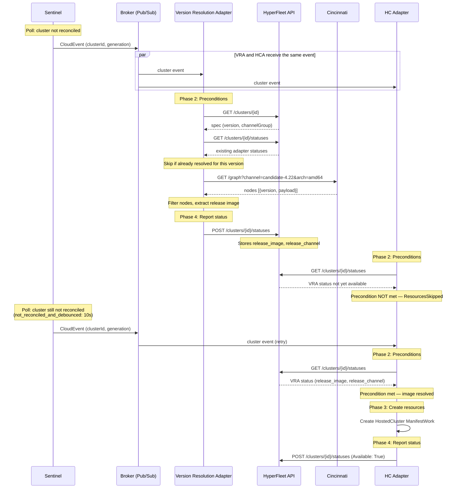

# Version Resolution Adapter

> **Status**: Superseded — The adapter framework is replaced by Go controllers per [Go Controllers Runtime](../design-decisions/automation/go-controllers-runtime.md). The business logic documented here carries forward.

**Jira**: TBD

| Field | Value |
|-------|-------|
| **Identifier** | `version-resolution-adapter` |
| **Transport** | None (compute-only — HTTP calls only) |
| **Runs on** | Region cluster |
| **Depends on** | HyperFleet API (cluster spec), Cincinnati API (version resolution) |

## Overview

Resolves an OCP version string (e.g., `4.22.0-ec.4`) to a release image pullspec via the OpenShift Cincinnati update service. This is a **compute-only adapter** — it does not create Kubernetes resources or ManifestWorks. It queries an external API, derives the release image, and reports the result as status metadata for downstream adapters to consume.

The `hostedcluster-adapter` depends on this adapter's status to populate the HostedCluster CR's `spec.release.image` and `spec.channel` fields.

A separate deployment of this adapter will be needed for NodePool version resolution once independent nodepool versioning is supported.

## Behavior

### Flow



### Pipeline Phases

1. **Phase 1 (Params)** — extracts `clusterId`, `generation` from the CloudEvent, and `cincinnatiBaseUrl` and `arch` from the environment (configurable per environment, `arch` defaults to `amd64`)
2. **Phase 2 (Preconditions)** — fetches cluster spec, gates on `version` and `channelGroup` being set, checks if already resolved for this version (avoids unnecessary Cincinnati calls), derives the Cincinnati channel name, queries Cincinnati, filters response for matching version
3. **Phase 3 (Resources)** — skipped (`resources: []`)
4. **Phase 4 (Post-Actions)** — reports status with `Applied`, `Available`, `Health` conditions and metadata (`release_image`, `release_version`, `release_channel`, `release_channel_group`)

## Preconditions & Gating

| Step | Gate | CEL Expression |
|------|------|----------------|
| 1 | Fetch cluster spec | `api_call: GET /clusters/{clusterId}` → captures `version`, `channelGroup` |
| 2 | Required fields set | `version != '' && channelGroup != ''` |
| 3 | Check existing status | `api_call: GET /clusters/{clusterId}/statuses` → captures `alreadyResolved` |
| 4 | Not already resolved | `!alreadyResolved` |
| 5 | Derive channel name | Captures `channel` = `channelGroup + '-' + version.split('.')[0] + '.' + version.split('.')[1]` (requires `ext.Strings()`) |
| 6 | Query Cincinnati | `api_call: GET {cincinnatiBaseUrl}?channel={channel}&arch={arch}` → captures `releaseImage` |

**`alreadyResolved` derivation** (Step 3) — CEL expression evaluated against the statuses API response:

```
existingStatus.exists(s,
  s.adapter == 'version-resolution-adapter' &&
  s.data.release_version == version &&
  s.conditions.exists(c, c.type == 'Available' && c.status == 'True')
)
```

Returns `true` when the VR adapter has already reported a successful resolution for the same version. When `true`, steps 5-6 (channel derivation and Cincinnati call) are skipped entirely.

The adapter only calls Cincinnati when:
- First resolution (no existing status)
- Version changed (`spec.release.version` differs from `data.release_version` in existing status)
- Previous resolution failed (no `Available: True` in existing status)

## Status Reporting

| Condition | Meaning |
|-----------|---------|
| `Applied` | Version successfully resolved via Cincinnati |
| `Available` | Resolution complete — release image available for downstream consumers |
| `Health` | Adapter execution health |

When skipping (already resolved), the adapter follows the placement adapter pattern: reports `Applied: False`, `Available: Unknown`, `Health: False (ResourcesSkipped)`. The API discards `Available: Unknown` on subsequent reports (204 No Content), preserving the existing good status.

Status `data` includes:

| Field | Example |
|-------|---------|
| `release_image` | `quay.io/openshift-release-dev/ocp-release@sha256:b84ed0c...` |
| `release_version` | `4.22.0-ec.4` |
| `release_channel` | `candidate-4.22` |
| `release_channel_group` | `candidate` |

## Adapter Coordination

Both the VR adapter and the HC adapter subscribe to the same Pub/Sub topic and receive events concurrently. Since the HC adapter depends on the VR adapter's status, there is a timing dependency:

- If the HC adapter runs before the VR adapter has reported, its precondition fails (`ResourcesSkipped=true`)
- The Sentinel re-publishes the event after `not_reconciled_and_debounced` (default: 10s) + `poll_interval` (default: 5s)
- On retry, the HC adapter finds the VR adapter's status and proceeds

This is the current adapter framework's intended coordination mechanism — eventual consistency via Sentinel re-reconciliation. The adapters are not aware of each other; coordination happens through shared state in the HyperFleet API.

## Error Handling

| Scenario | Cause | Adapter Behavior | Reason | Retryable? |
|----------|-------|-------------------|--------|------------|
| Version resolved | Happy path | `Applied: True`, `Available: True` | `VersionResolved` | N/A |
| Version not found | Version doesn't exist in the channel | `Applied: False`, `Available: False` | `VersionNotFound` | No — user must fix `spec.release.version` |
| Cincinnati unavailable | Network error, timeout, API down | Execution error | `ResolutionFailed` | Yes — next reconcile retries |

- **VersionNotFound** is a permanent failure. The status message includes the version and channel so the user knows what to fix.
- **Cincinnati unavailable** is transient. The `api_call` retries 3 times with exponential backoff. If all fail, the next reconcile event (~15s) retries.

## Idempotency & Edge Cases

- **First run**: resolves version via Cincinnati, reports status with release image
- **Subsequent runs (same version)**: detects existing status with matching version, skips Cincinnati call entirely
- **Spec update (version change)**: existing status has different `release_version`, triggers new Cincinnati resolution
- **Previous failure**: no `Available: True` in existing status, retries Cincinnati resolution

## Pre-production Version Support

The Cincinnati endpoint is configurable per environment:

| Environment | `CINCINNATI_BASE_URL` |
|-------------|----------------------|
| Production | `https://api.openshift.com/api/upgrades_info/v1/graph` |
| Dev / Integration | TBD — release controller provides a Cincinnati-compatible graph for nightlies and CI builds |

Direct release image injection (bypassing Cincinnati via `spec.release.image`) is out of scope for this adapter.

## Credentials

| Credential | Access | Source |
|-----------|--------|--------|
| GCP SA | Pub/Sub subscription | Workload Identity on region cluster |
| HyperFleet API | Cluster details + status POST | In-cluster service |
| Cincinnati API | Public endpoint, no auth | Direct HTTPS |

## Dependencies

1. **CEL `split()` support in the adapter framework** — The adapter's CEL environment ([`cel_evaluator.go`](https://github.com/openshift-hyperfleet/hyperfleet-adapter/blob/main/internal/criteria/cel_evaluator.go)) does not currently register the `ext.Strings()` extension. This is needed for channel name derivation (`version.split('.')[0]`). The fix is a one-line addition (`cel.Lib(ext.Strings())`) in `buildCELOptions()`. The `ext` package is part of `cel-go` which is already a dependency.

2. **HC adapter must read release image from VR adapter status** — The current HC adapter ([PR #460](https://github.com/openshift-online/gcp-hcp-infra/pull/460)) hardcodes the release image via the `HC_RELEASE_IMAGE` environment variable. Changes needed:
   - New precondition fetching `/clusters/{id}/statuses` and capturing `release_image` and `release_channel` from VR adapter data
   - Gating condition blocking until `release_image` is available
   - HostedCluster manifest template updated to use:
     - `spec.release.image: {{ .releaseImage }}` (resolved pullspec)
     - `spec.channel: {{ .releaseChannel }}` (e.g., `candidate-4.22` — enables CVO upgrade checks)
   - Remove or demote `HC_RELEASE_IMAGE` env var

3. **CLI must require `version` and `channelGroup`** — The HyperFleet API spec is intentionally provider-agnostic (`ClusterSpec` is a free-form object). Validation of `spec.release.version` and `spec.release.channelGroup` belongs in the CLI layer. The VR adapter's gating expression (`version != '' && channelGroup != ''`) serves as a safety net if something bypasses the CLI.

4. **VR adapter must report `Health` condition** — The HyperFleet API requires three mandatory conditions: `Applied`, `Available`, and `Health`. When skipping (already resolved), the adapter follows the placement adapter pattern: report `Applied: False`, `Available: Unknown`, `Health: False (ResourcesSkipped)`. The API discards `Available: Unknown` on subsequent reports (204 No Content), preserving the existing good status.

5. **Sentinel re-reconciliation** — Adapter chaining relies on the Sentinel re-publishing events for clusters that are not fully reconciled. The default `not_reconciled_and_debounced` interval is 10 seconds, with a `poll_interval` of 5 seconds. This means the HC adapter will retry within ~15 seconds after the VR adapter completes. This is the established pattern (confirmed from placement adapter logs — skipped executions return 204 No Content).

## Design Alternatives Considered

| Alternative | Pros | Cons | Decision |
|------------|------|------|----------|
| Custom Go service (CLS approach) | Full control, proven | Requires custom code, build, deploy for any logic change | Rejected — adapter framework achieves the same with YAML config |
| Job-based adapter | Proven pattern, used by placement adapter | Unnecessary complexity — no long-running work, just an HTTP call | Rejected — compute-only adapter is simpler |
| CRD + Controller | Kubernetes-native watch for immediate adapter coordination | Not supported by current adapter framework; adapters are event-driven via Pub/Sub, not watches | Future consideration when adapter framework evolves |
| gRPC microservice | Best scalability, synchronous calls | Not supported by adapter framework yet (CLM team capacity, 6+ months out) | Future consideration |
| API-level spec validation | Enforces required fields at the API layer | Breaks provider-agnostic design of ClusterSpec | Rejected — validation belongs in CLI |

## Backlog

| Story | Jira | Status |
|-------|------|--------|
| Add CEL `ext.Strings()` to adapter framework | TBD | Not Started |
| Implement version-resolution-adapter config | TBD | Not Started |
| Update HC adapter to read release image from VR adapter status | TBD | Not Started |
| Add `version` and `channelGroup` validation to CLM CLI | TBD | Not Started |
| Support configurable `arch` param for multi-arch clusters | TBD | Not Started |
| Support direct release image injection (`spec.release.image` override) | TBD | Not Started |