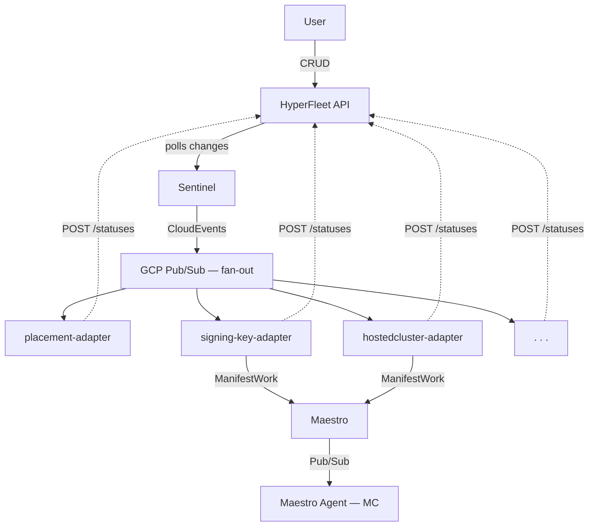

# GCP-333: GCP HCP HyperFleet Adapters Implementation Plan

> **Status**: Superseded — The config-based adapter framework is replaced by Go controllers per [Go Controllers Runtime](../design-decisions/automation/go-controllers-runtime.md). Business logic carries forward into Go controllers.

**Status**: ~~In Progress~~
**Jira**: [GCP-333](https://redhat.atlassian.net/browse/GCP-333)
**Last Updated**: 2026-04-05

---

## Overview

This document covers the design and implementation of the GCP adapters for HyperFleet framework — the set of independent, config-driven components that collectively provision and manage OpenShift Hosted Control Planes on GCP. Adapters operate within Red Hat-managed infrastructure (region and management clusters), while respecting the boundary that customer GCP project resources are set up by the customer or CLI tooling.

## Architecture Context

HyperFleet uses an event-driven adapter architecture. A central HyperFleet API stores cluster state, and a Sentinel component polls the API for changes and publishes reconcile CloudEvents to a shared GCP Pub/Sub topic (`hyperfleet-cluster-events`). Each adapter subscribes independently to this topic — all adapters receive every event in parallel. Each adapter evaluates CEL-based preconditions against the cluster's current status and only proceeds when its dependencies are satisfied.



Adapters are deployments of the same `hyperfleet-adapter` binary with different YAML configs (AdapterConfig + AdapterTaskConfig). They execute a 4-phase pipeline:

1. **params** — extract parameters from the CloudEvent and environment
2. **preconditions** — fetch cluster data from the API, evaluate gates (CEL expressions)
3. **resources** — create/update resources (Kubernetes Job or Maestro ManifestWork)
4. **post** — evaluate status conditions (CEL), POST status to HyperFleet API

Each adapter reports three mandatory conditions: `Applied`, `Available`, `Health`.

### Maestro Transport Layer

Adapters that create resources on management clusters (e.g. adapter-hc, signing-key-adapter, etc.) use Maestro as the transport layer. Maestro replaces direct kubeconfig-based access with asynchronous GCP Pub/Sub channels, removing cross-cluster network dependencies.

Maestro has its own set of GCP Pub/Sub topics, separate from the HyperFleet topic used for Sentinel → Adapter communication. Status flows back through the same path: Maestro agents report resource status via Pub/Sub, Maestro Server streams it to the adapter via gRPC, and the adapter evaluates CEL expressions against the status before posting conditions to the HyperFleet API. There is no direct Maestro → HyperFleet API integration — adapters are the single authority for translating resource state into the HyperFleet status contract.

For full Maestro Pub/Sub topology, consumer registration, and infrastructure details, see [GCP-334: Maestro Setup](gcp-334-hyperfleet-maestro-setup.md).

## Adapter Decomposition

### Dependency Chain

```
placement-adapter → signing-key-adapter → hostedcluster-adapter → ...
```

> **Note:** This chain will grow as new lifecycle concerns are added (e.g. validation, pull-secret provisioning, node pool management). New adapters can be inserted into or branched off the chain via CEL preconditions — no changes to existing adapters are required.

### Implemented Adapters

| Adapter | Identifier | Transport | Depends on | Details |
|---------|-----------|-----------|------------|---------|
| [Placement Decision](adapter-placement-decision.md) | `placement-adapter` | K8s Job (Region) | None | Selects target MC and DNS zone |
| [Signing Key](adapter-signing-key.md) | `signing-key-adapter` | Maestro ManifestWork | `placement-adapter` | Provisions RSA keypair on MC |
| [HostedCluster](adapter-hostedcluster.md) | `hostedcluster-adapter` | Maestro ManifestWork | `signing-key-adapter` | Materializes control plane on MC |

### Planned Adapters

The following adapters are planned but not yet implemented. Each will get its own document following the [adapter document template](#adapter-document-template) when picked up.

- **validation-adapter** — Validates that the customer's GCP project is correctly configured (APIs enabled, WIF pool/provider, VPC/PSC, IAM roles) before provisioning proceeds. Runs as a Job on the region cluster using a read-only SA granted by the customer.
- **pull-secret-adapter** — Provisions the pull secret on the MC as a standalone step, decoupled from the HostedCluster adapter.
- **nodepool-adapter** — Creates, scales, updates, and deletes NodePool CRs on the MC via Maestro. Listens to nodepool reconcile events (separate from cluster events) and gates on HostedCluster availability.

---

## Cross-Cutting Concerns

### Status Reporting

All adapters POST to `/clusters/{id}/statuses` (or `/nodepools/{id}/statuses`) with:
- `adapter`: stable identifier
- `observed_generation`: matches resource generation when work is done
- `conditions`: `Applied`, `Available`, `Health` (mandatory)
- `data`: optional structured data (e.g., signing-key-adapter reports secret name)

### Error Handling and Idempotency

- Adapters must be idempotent — re-running on the same generation produces the same result
- Adapters always report status, even when skipping work (preconditions not met)
- Broker messages are ACKed after processing regardless of outcome (no infinite retry)
- HyperFleet API client retries on 5xx/408/429 with exponential backoff

### Credential Management

All adapters use Workload Identity Federation (WIF) for GCP access — no static service account keys. Each adapter's Helm chart provisions its own GCP resources (Service Account, WIF binding, Pub/Sub subscription, IAM roles) via Config Connector. Per-adapter credentials are documented in each adapter's section above.

### Deployment Model

Adapters are deployed as Helm charts via ArgoCD ApplicationSets defined in `gcp-hcp-infra`. Each adapter has an ArgoCD application template in the region config that deploys its chart to the `hyperfleet` namespace on the region cluster.

---

## Adapter Document Template

All adapter documents follow a consistent structure. When creating a new adapter, copy this template:

```markdown
# {Adapter Name}

| Field | Value |
|-------|-------|
| **Identifier** | `{adapter-id}` |
| **Transport** | {K8s Job / Maestro ManifestWork / ...} |
| **Runs on** | {Region cluster / MC / ...} |
| **Depends on** | {upstream adapter(s)} |

## Overview
## Behavior
## Preconditions & Gating
## Status Reporting
## Idempotency & Edge Cases
## Credentials
## Design Alternatives Considered
## Open Questions
## Backlog
```

---

## Implementation Backlog (Stories)

Stories for implemented adapters are tracked in their respective documents. The following are cross-cutting or planned adapter stories:

| Story | Jira | Status | Adapter |
|-------|------|--------|---------|
| Implement nodepool-adapter (NodePool lifecycle via Maestro) | TBD | Not Started | `nodepool-adapter` |
| Implement validation-adapter (customer GCP project checks) | TBD | Not Started | `validation-adapter` |
| E2E test for full adapter chain (placement → signing-key → HC → nodepool) | TBD | Not Started | All |

---

## References

### Architecture
- [HyperFleet Architecture](https://github.com/openshift-hyperfleet/architecture) — `hyperfleet/architecture/architecture-summary.md`
- [Adapter Framework Design](https://github.com/openshift-hyperfleet/architecture) — `hyperfleet/components/adapter/framework/`
- [Adapter Status Contract](https://github.com/openshift-hyperfleet/architecture) — `hyperfleet/components/adapter/framework/adapter-status-contract.md`
- [HyperFleet API Status Guide](https://github.com/openshift-hyperfleet/architecture) — `hyperfleet/docs/status-guide.md`
- [Maestro Integration Guide](https://github.com/openshift-hyperfleet/architecture) — `hyperfleet/components/adapter/framework/maestro-integration-guide.md`

