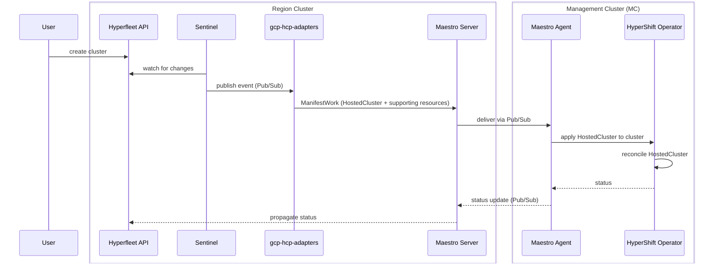

# Hyperfleet & Maestro — Infrastructure Setup Overview

This document describes the architecture and GitOps work required to deploy the
Hyperfleet core components and the Maestro messaging layer on GCP HCP infrastructure.

The following shows the end-to-end request flow from cluster creation to HostedCluster provisioning:



---

## Cluster Topology

```
Region Cluster (GKE Autopilot, one per region)
├── Hyperfleet core components (API, Sentinel, Adapters)
├── Maestro Server
└── Region GCP resources: shared Pub/Sub topics + GCP SAs/IAM (Config Connector), per-MC subscriptions (Terraform)

Management Cluster / MC (GKE, one or more per region)
└── Maestro Agent  ← receives ManifestWork from Maestro Server, drives HostedCluster creation
```

---

## Region Cluster — ArgoCD Applications

Applications are deployed in sync-wave order. Earlier waves must complete
before later ones start.

### Infrastructure layer (waves -10 to -5)

| Application | Wave | Purpose | Chart |
|---|---|---|---|
| `maestro-cloud-resources` | -10 | Pub/Sub topics, server subscriptions, GCP SAs + IAM for Maestro; includes consumer-registration CronJob that auto-registers MCs as Maestro consumers | custom chart in `gcp-hcp-infra` |
| `hyperfleet-cloud-resources` | -5 | Pub/Sub topic + IAM for Hyperfleet adapters and Sentinel | custom chart in `gcp-hcp-infra` |

### Application layer

| Application | Wave | Purpose | Chart |
|---|---|---|---|
| `maestro-server` | -5 | Maestro messaging server (connects to region Pub/Sub) | upstream `openshift-online/maestro` |
| `hyperfleet-api` | 0 | Hyperfleet REST API | upstream `openshift-hyperfleet/hyperfleet-api`, path `charts/` |
| `hyperfleet-sentinel` | 0 | Watches Hyperfleet API, publishes cluster events to Pub/Sub | upstream `openshift-hyperfleet/hyperfleet-sentinel`, path `deployments/helm/sentinel/` |
| `gcp-hcp-adapters` | 0 | Consumes cluster events; creates HostedCluster on MC via Maestro | upstream `gcp-adapters`, path `charts/adapter-hc/` |

> Over time, additional adapters will be introduced to handle concerns such as public/private
> key management, pull secret provisioning, validation and preflight checks, and cluster
> placement. Each adapter owns a discrete phase of the lifecycle.

---

## Management Cluster — ArgoCD Applications

| Application | Wave | Purpose | Chart |
|---|---|---|---|
| `maestro-agent` | 0 | Receives ManifestWork from Maestro Server, applies resources to cluster | upstream `openshift-online/maestro`, path `charts/maestro-agent/` |

---

## Maestro

Maestro is the messaging layer between the region cluster and MC clusters.
It replaces direct kubeconfig-based access with an asynchronous GCP Pub/Sub
channel, removing cross-cluster network dependencies and expiring credentials.

### GCP Pub/Sub topology

```
Region Project — 4 shared topics, created once per region:

  sourceevents          ← server → agent: targeted work delivery (filtered by MC)
  sourcebroadcast       ← server → all agents: broadcast commands
  agentevents           ← agent → server: status updates
  agentbroadcast        ← agent → all server instances: status broadcast (HA mode)

Server-side subscriptions (one set, shared across all MCs):
  agentevents-server    → reads from agentevents
  agentbroadcast-server → reads from agentbroadcast

Per-MC subscriptions (two per MC, created by Terraform at MC provision time):
  sourceevents-{mc}     → filtered: only events targeted at this MC
  sourcebroadcast-{mc}  → all broadcast messages
```

### What creates what

| Resource | Created by | When |
|---|---|---|
| 4 shared topics | `maestro-cloud-resources` chart (Config Connector) | Region cluster deploy |
| Server subscriptions | `maestro-cloud-resources` chart (Config Connector) | Region cluster deploy |
| Maestro Server GCP SA + IAM | `maestro-cloud-resources` chart (Config Connector) | Region cluster deploy |
| Maestro Agent GCP SA + IAM | `maestro-cloud-resources` chart (Config Connector) | Region cluster deploy |
| Per-MC subscriptions | Terraform (`management-cluster/maestro.tf`) | MC provisioned |
| WIF bindings (agent SA) | Terraform (`management-cluster/maestro.tf`) | MC provisioned |
| Maestro consumer registration | `maestro-cloud-resources` chart (CronJob) | Every 5 min, on region cluster |


### Consumer registration

Each MC must be registered as a named consumer in the Maestro server before
ManifestWork can be sent to it. The Maestro server is a ClusterIP-only service
on the region cluster, unreachable from the MC or any external system, so
registration must happen from within the region cluster itself.

#### Approach

A `consumer-registration` CronJob runs on the region cluster every 5 minutes.
It continuously reconciles the set of known MCs against the Maestro consumer
inventory and registers any MC that is missing — making onboarding zero-touch
and resilient to transient failures.

The reconciliation loop:

1. Lists all Secret Manager secrets in the region project labelled `cls-registration=true`
2. Reads the `consumer-name` label from each secret to determine the MC identity
3. Compares against the current list of registered Maestro consumers
4. Registers any MC present in Secret Manager but absent from Maestro
5. Skips already-registered MCs (fully idempotent)

#### Why Secret Manager as source of truth

When Terraform provisions a new MC it writes a Secret Manager secret labelled
`cls-registration=true` with `consumer-name` set to the MC's project ID. This
secret is the authoritative record that an MC exists and needs to be registered.

Secret Manager was chosen over alternatives such as the GKE Hub Fleet API because
it is already used by the MC provisioning flow (`cls-registration.tf`), requires
no additional GCP APIs, and is directly writable by Terraform at MC creation time.
The consumer list is simply whatever secrets Terraform has written — no separate
inventory to maintain.

#### Why a reconciliation loop, not a one-shot trigger

One-shot approaches were considered (a Pub/Sub event from the MC, or a Cloud
Workflow triggered by Terraform) but ruled out: if the trigger is lost, delayed,
or the Maestro server is temporarily unavailable, the MC is silently never
registered with no automatic recovery. A continuous loop converges to the correct
state regardless of transient failures, Maestro restarts, or partial state loss.

#### Packaging

The CronJob is currently part of the `maestro-cloud-resources` chart for
simplicity. As it grows to cover drift correction, MC state management, and
capacity-driven auto-scaling, it should move into a dedicated `mc-registration`
chart with its own ArgoCD application and scoped RBAC.

---

## Key Repositories

| Repository | Purpose |
|---|---|
| `gcp-hcp-infra` | Infrastructure-as-code: Terraform, Helm charts, ArgoCD configs |
| `gcp-hcp` | GCP-specific adapters (`gcp-hcp-adapters`) |
| [openshift-hyperfleet](https://github.com/openshift-hyperfleet) | Hyperfleet core components (API, Sentinel, Adapter framework) |
| `openshift-online/maestro` | Upstream Maestro (used directly via ArgoCD, not forked) |
