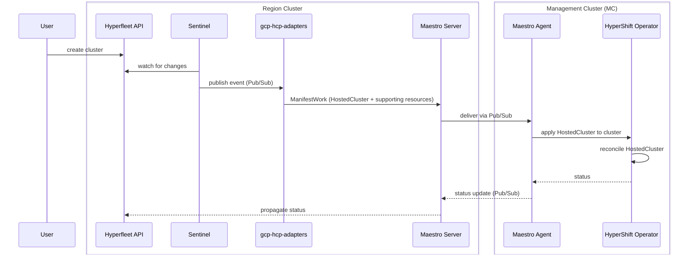
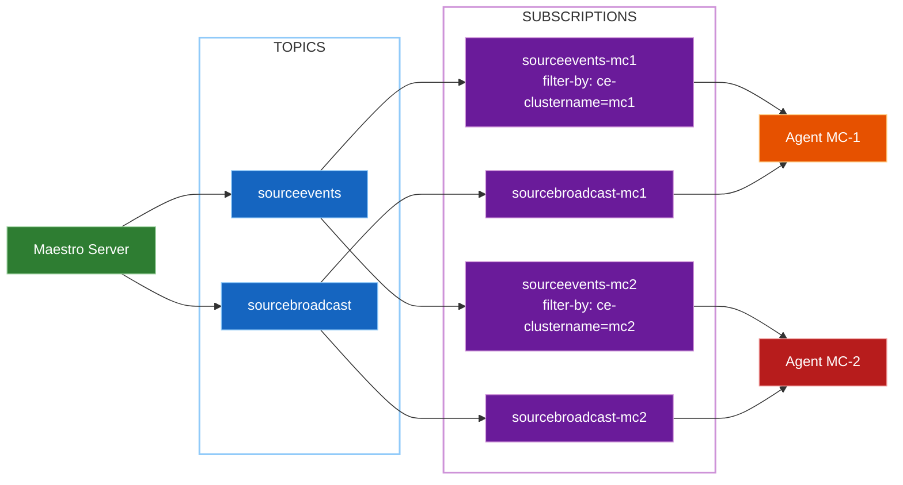
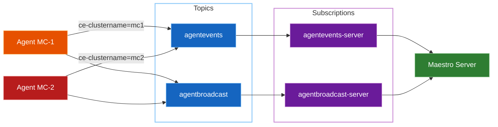
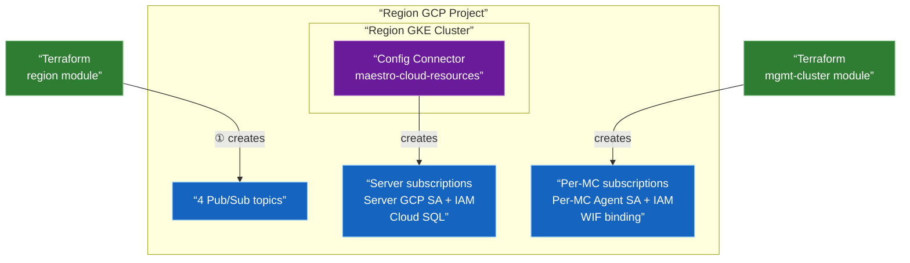

# Hyperfleet & Maestro — Infrastructure Setup Overview

> **Status**: Superseded — Maestro transport replaced by [Firestore Transport](../design-decisions/networking/datastore-transport.md). Adapter framework and Sentinel replaced by [Go Controllers Runtime](../design-decisions/automation/go-controllers-runtime.md).

This document describes the architecture and GitOps work required to deploy the
Hyperfleet core components and the Maestro messaging layer on GCP HCP infrastructure.

The following shows the end-to-end request flow from cluster creation to HostedCluster provisioning:



---

## Deployment Topology

```
Region Cluster (GKE Autopilot, one per region)
├── Hyperfleet core components (API, Sentinel)
├── GCP HCP Adapters (HostedCluster, NodePool, PullSecret, SigningKey, Validation etc)
├── Maestro Server
└── Region GCP resources (Maestro + Hyperfleet): Pub/Sub topics, GCP service accounts + IAM, Cloud SQL etc

Management Cluster / MC (GKE, one or more per region)
├── Maestro Agent  ← receives ManifestWork from Maestro Server, drives HostedCluster creation
└── MC GCP resources: per-MC Pub/Sub subscriptions, WIF bindings etc
```

---

## Region Cluster — ArgoCD Applications

Applications are deployed in sync-wave order. Earlier waves must complete
before later ones start.

### Infrastructure layer (wave -5)

| Application | Wave | Purpose | Chart |
|---|---|---|---|
| `maestro-cloud-resources` | -5 | Server-side Pub/Sub subscriptions, server GCP SA + IAM, Cloud SQL instance + credentials; includes consumer-registration CronJob that auto-registers MCs as Maestro consumers | custom chart in `gcp-hcp-infra` |
| `hyperfleet-cloud-resources` | -5 | Pub/Sub topic + IAM for Hyperfleet adapters and Sentinel | custom chart in `gcp-hcp-infra` |

Wave -5 applications (`maestro-cloud-resources`, `hyperfleet-cloud-resources`) can run in parallel; order between them is not significant.

### Application layer (wave 0)

| Application | Wave | Purpose | Chart |
|---|---|---|---|
| `maestro-server` | 0 | Maestro messaging server | upstream `openshift-online/maestro`, path `charts/maestro-server/` |
| `hyperfleet-api` | 0 | Hyperfleet REST API | upstream `openshift-hyperfleet/hyperfleet-api`, path `charts/` |
| `hyperfleet-sentinel` | 0 | Watches Hyperfleet API, publishes cluster events to Pub/Sub | upstream `openshift-hyperfleet/hyperfleet-sentinel`, path `deployments/helm/sentinel/` |
| `gcp-hcp-adapters` | 0 | Consumes cluster events; creates HostedCluster on MC via Maestro |  chart path TBD (see GCP-478) |


> Over time, multiple adapters will be introduced to handle concerns such as public/private
> key management, pull secret provisioning, validation and preflight checks, and cluster
> placement. Each adapter owns a discrete phase of the lifecycle.

---

## Management Cluster — ArgoCD Applications

| Application | Wave | Purpose | Chart |
|---|---|---|---|
| `maestro-agent` | 0 | Receives ManifestWork from Maestro Server, applies resources to cluster | upstream `openshift-online/maestro`, path `charts/maestro-agent/` |

---

## Maestro

Maestro is the messaging layer between the region cluster and MC clusters.
It replaces direct kubeconfig-based access with an asynchronous GCP Pub/Sub
channel, removing cross-cluster network dependencies and expiring credentials.

The Maestro Server runs on the region cluster and persists resources and their
status in a Cloud SQL (PostgreSQL) database. It sends Kubernetes manifests
(ManifestWork) to MC clusters via CloudEvents over Pub/Sub. The Maestro Agent
runs on each MC cluster, receives those manifests, applies them locally (e.g.
creating HostedCluster objects), and reports status back to the server through
the same Pub/Sub channel. This decouples the region cluster from needing direct
network access to each MC's Kubernetes API server.

### GCP Pub/Sub topology

Maestro expects exactly 4 Pub/Sub topic names per project (defined by the OCM SDK). All MC
agents in the region share the same 4 topics — there are no separate topics per agent.

Instead, **agent isolation** is achieved through per-MC **subscriptions**. Each MC Agent reads from its own pair of subscriptions(sourceevents-{mc} and sourcebroadcast-{mc}) on the sourceevent topics. A subscription in Pub/Sub is like a named queue on top of a topic — each subscriber independently reads messages from it. The sourceevents-{mc} subscription is configured with a filter so that GCP only delivers messages tagged for that specific MC (via the ce-clustername attribute). Messages intended for other MCs are dropped by GCP before delivery — the agent never sees work that is not its own. The sourcebroadcast-{mc} subscription carries no filter, as broadcast commands are intentionally delivered to all agents.


```
Region Project — 4 shared topics, created once per region:

  sourceevents          ← server → agent: targeted work delivery (filtered by MC)
  sourcebroadcast       ← server → all agents: broadcast commands
  agentevents           ← agent → server: status updates
  agentbroadcast        ← agent → all server instances: status broadcast (HA mode)

Server-side subscriptions (one set, shared across all MCs):
  agentevents-server    → reads from agentevents
  agentbroadcast-server → reads from agentbroadcast

Per-MC subscriptions (two per MC, created by Terraform at MC provision time):
  sourceevents-{mc}     → Pub/Sub subscription filter: ce-clustername = "{mc}"
  sourcebroadcast-{mc}  → all broadcast messages (no filter needed)
```


**① Server → Agents (work delivery):**



**② Agents → Server (status):**



**Comparison with MQTT**: In MQTT mode, each agent subscribes to its own topic
path (e.g. `clusters/{mc}/sourceevents`), so isolation is topic-based. In
Pub/Sub mode, topics are shared and isolation is subscription-filter-based.
The end result is equivalent agent isolation, just implemented differently by
the OCM SDK transport layer.

| | MQTT | GCP Pub/Sub |
|---|---|---|
| Routing model | Topic path hierarchy with wildcards | Flat topics + subscription filters |
| Per-agent isolation | Native (topic path contains consumer name) | Via subscription filter on `ce-clustername` attribute |
| SDK approach | Topic name encodes the consumer | Single shared topic, filter applied at subscription |


### Resource Provisioning




| Resource | Created by | When |
|---|---|---|
| 4 shared topics (`sourceevents`, `sourcebroadcast`, `agentevents`, `agentbroadcast`) | Terraform (`region/maestro.tf`) | Region cluster deploy |
| Server subscriptions (`agentevents-server`, `agentbroadcast-server`) | `maestro-cloud-resources` chart (Config Connector) | Region cluster deploy |
| Maestro Server GCP SA + IAM | `maestro-cloud-resources` chart (Config Connector) | Region cluster deploy |
| Cloud SQL instance, database, user + credentials secret | `maestro-cloud-resources` chart (Config Connector + ESO) | Region cluster deploy |
| Per-MC subscriptions (`sourceevents-{mc}`, `sourcebroadcast-{mc}`) | Terraform (`management-cluster/maestro.tf`) | MC provisioned |
| Per-MC Agent GCP SA + IAM (subscriber on own subscriptions, publisher on agent-side topics) | Terraform (`management-cluster/maestro.tf`) | MC provisioned |
| WIF binding (MC k8s SA → per-MC Agent GCP SA) | Terraform (`management-cluster/maestro.tf`) | MC provisioned |
| Maestro consumer registration | `maestro-cloud-resources` chart (CronJob) | Every 5 min, on region cluster |

> **Why Terraform for topics?** The 4 Pub/Sub topics are shared across the region cluster and all
> MC clusters. They must exist before any MC is provisioned, since each MC creates its own
> subscriptions on these topics. The per-MC subscriptions are cross-project (topics live in the
> region project, the MC has its own project) and are set up via Terraform in the
> `management-cluster` module. Since Terraform manages the subscriptions, the topics they depend on
> must also be in Terraform — in the region module — to guarantee they are provisioned first.

> **Why a per-MC Agent GCP SA?** Each MC agent gets its own GCP SA in the region project, granted
> only `pubsub.subscriber` on its own two subscriptions and `pubsub.publisher` on the shared
> agent-side topics. This is least-privilege: an agent cannot access another MC's subscriptions at
> the IAM level, independent of message filters. All Agent SA provisioning and IAM happen in
> `management-cluster/maestro.tf` at MC provision time, since the region cluster has no knowledge
> of MC project IDs.

### Consumer registration

Each MC must be registered as a named consumer in the Maestro server before
ManifestWork can be sent to it. The Maestro server is a ClusterIP-only service
on the region cluster, unreachable from the MC or any external system, so
registration must happen from within the region cluster itself.

#### Approach

A `maestro-consumer-registration` CronJob runs on the region cluster every 5 minutes.
It periodically reconciles the set of known MCs against the Maestro consumer
inventory (every 5 minutes) and registers any MC that is missing — making
onboarding zero-touch and resilient to transient failures.

The reconciliation loop:

1. Lists all Secret Manager secrets in the region project labelled `maestro-consumer-name:*`
2. Reads the `maestro-consumer-name` label from each secret to determine the MC identity
3. Compares against the current list of registered Maestro consumers
4. Registers any MC present in Secret Manager but absent from Maestro
5. Skips already-registered MCs (fully idempotent)

#### Why Secret Manager as source of truth

When Terraform provisions a new MC it writes a Secret Manager secret with a
`maestro-consumer-name` label (set in `cls-registration.tf`, value is the MC's
project ID) so the CronJob can identify each MC. This secret is
the authoritative record that an MC exists and needs to be registered. The
`maestro-consumer-name` label is what Maestro uses as the consumer identity. (If
multiple MCs ever share a region project, secret naming would need to be
revisited; for now we do not rely on that case.)

Secret Manager was chosen over alternatives such as the GKE Hub Fleet API because
it is already used by the MC provisioning flow (`cls-registration.tf`), requires
no additional GCP APIs, and is directly writable by Terraform at MC creation time.
The consumer list is simply whatever secrets Terraform has written — no separate
inventory to maintain.

#### Why a reconciliation loop, not a one-shot trigger

One-shot approaches were considered (a Pub/Sub event from the MC, or a Cloud
Workflow triggered by Terraform) but ruled out: if the trigger is lost, delayed,
or the Maestro server is temporarily unavailable, the MC is silently never
registered with no automatic recovery. A continuous loop converges to the correct
state regardless of transient failures, Maestro restarts, or partial state loss.

#### Packaging

The CronJob is currently part of the `maestro-cloud-resources` chart for
simplicity. As it grows to cover drift correction, MC state management, and
capacity-driven auto-scaling, it should move into a dedicated `mc-registration`
chart with its own ArgoCD application and scoped RBAC.

### Status propagation (Server → API)

Agent status updates flow from the Maestro Agent to the Maestro Server via the
`agentevents` (and optionally `agentbroadcast`) Pub/Sub topic described above.
How the Server propagates that status into the Hyperfleet API is
implementation-defined: for example, the Server may call back into the API, or
a separate component (e.g. Sentinel or an API-side listener) may consume agent
events and update cluster status. The sequence diagram shows the logical flow;
the exact integration point (API endpoint, webhook, or event consumer) should
be agreed when implementing.

---

## Key Repositories

| Repository | Purpose |
|---|---|
| `gcp-hcp-infra` | Infrastructure-as-code: Terraform, Helm charts, ArgoCD configs |
| `gcp-hcp` | GCP-specific adapters (`gcp-hcp-adapters`) |
| [openshift-hyperfleet](https://github.com/openshift-hyperfleet) | Hyperfleet core components (API, Sentinel, Adapter framework) |
| `openshift-online/maestro` | Upstream Maestro (used directly via ArgoCD, not forked) |
