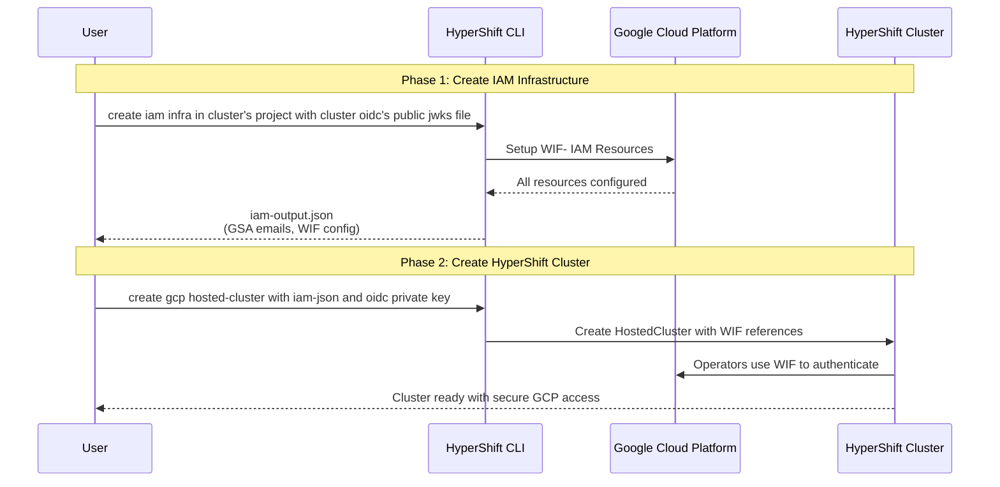
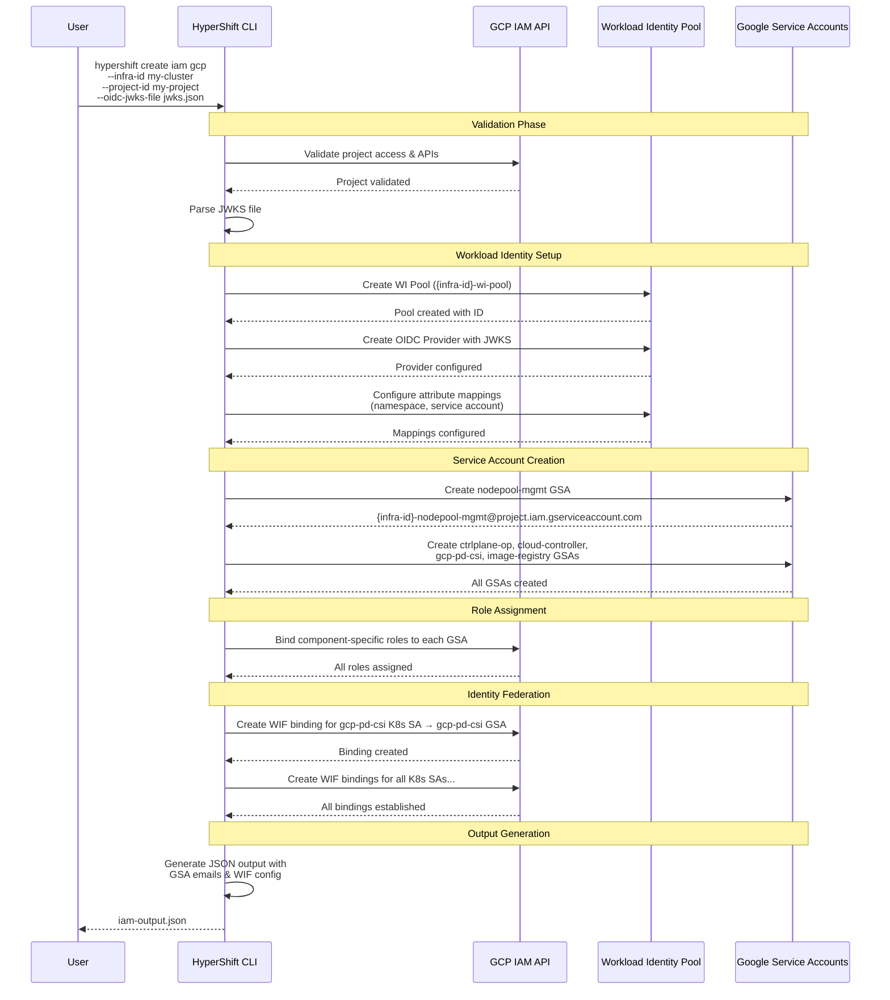
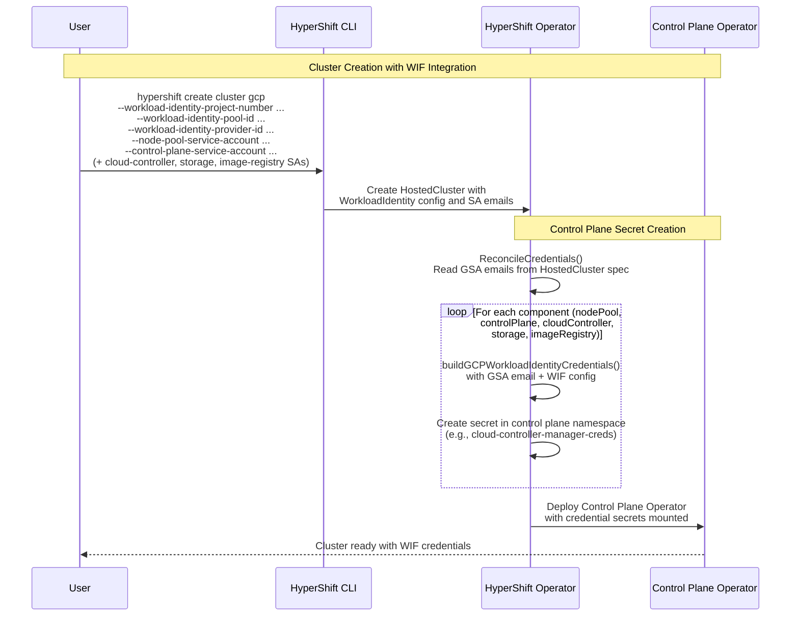
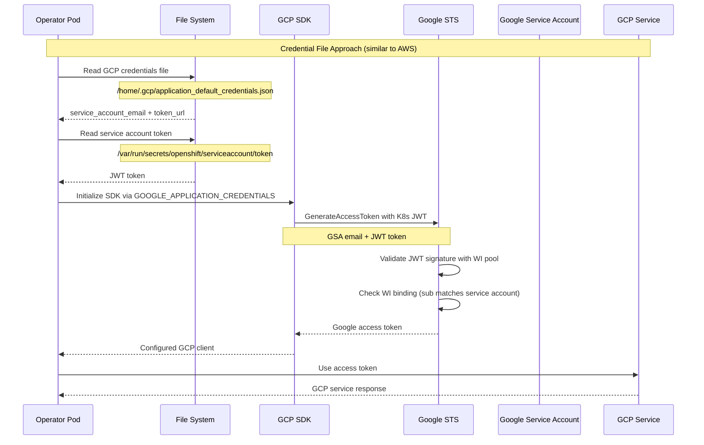

# GCP Hosted Clusters WIF Integration Design

**Date**:

2026-03-02 - update plan to match implementation
2025-10-30 (original)

## Overview

This document outlines the design of the GCP Workload Identity Federation (WIF) workflow for HyperShift GCP Hosted Clusters. The approach removes the need for long-lived service account keys by using credential files that reference Google Service Accounts and Kubernetes service account tokens.

## End-to-End User Workflow

The following sequence diagram shows how a user creates GCP IAM infrastructure and then uses it to create a HyperShift cluster:




## GCP IAM Infrastructure Creation
The HyperShift CLI will be extended to include a command that provisions the required GCP IAM infrastructure for a HyperShift cluster.

#### Command Structure

```bash
hypershift create iam gcp [flags]
```

#### Required Arguments

| Flag | Description | GCP Specifics |
|------|-------------|---------------|
| `--infra-id` | Cluster infrastructure identifier | Used as prefix for WI pool, provider, and GSA names |
| `--project-id` | GCP Project ID where resources will be created | Must have required APIs enabled |
| `--oidc-jwks-file` | Path to a local JSON file containing OIDC provider's public key in JWKS format | Required for configuring the Workload Identity Provider |

#### Optional Arguments

| Flag | Default | Description | GCP Specifics |
|------|---------|-------------|---------------|
| `--output-file` | stdout | Path to output JSON file with GSA details | Contains GSA emails and WIF configuration |
| `--oidc-issuer-url` | generated | Custom OIDC issuer URL | Defaults to `https://hypershift-{infra-id}-oidc` |


#### Overview of operations 
The following sequence diagram shows the detailed interactions during `hypershift create iam gcp` execution:



##### Sample Output Format

```json
{
  "projectId": "my-gcp-project",
  "projectNumber": "123456789012",
  "infraId": "my-cluster",
  "workloadIdentityPool": {
    "poolId": "my-cluster-wi-pool",
    "providerId": "my-cluster-k8s-provider",
    "audience": "//iam.googleapis.com/projects/123456789012/locations/global/workloadIdentityPools/my-cluster-wi-pool/providers/my-cluster-k8s-provider"
  },
  "serviceAccounts": {
    "nodepool-mgmt": "my-cluster-nodepool-mgmt@my-gcp-project.iam.gserviceaccount.com",
    "ctrlplane-op": "my-cluster-ctrlplane-op@my-gcp-project.iam.gserviceaccount.com",
    "cloud-controller": "my-cluster-cloud-controller@my-gcp-project.iam.gserviceaccount.com",
    "gcp-pd-csi": "my-cluster-gcp-pd-csi@my-gcp-project.iam.gserviceaccount.com",
    "image-registry": "my-cluster-image-registry@my-gcp-project.iam.gserviceaccount.com"
  }
}
```

##### Notes
- WIF pool provider is configured with the specified jwks file, making the issuer url irrelevant (a custom issuer URL can still be provided via `--oidc-issuer-url`)
- Google Service Accounts are created as needed for each cluster component/operator that needs to access GCP APIs
- GSA naming convention: `{infra-id}-{component}@{project}.iam.gserviceaccount.com`
- Service account definitions and role bindings are loaded from an embedded `iam-bindings.json` file
- Five service accounts are created: `nodepool-mgmt`, `ctrlplane-op`, `cloud-controller`, `gcp-pd-csi`, `image-registry`


## WIF Integration during Cluster Creation

During HyperShift GCP cluster creation, the previously created IAM infrastructure (Workload Identity Pool, Google Service Accounts, and WIF bindings) is integrated into the cluster to enable keyless authentication for all cluster components.

The cluster creation process requires two key inputs from the IAM infrastructure setup:

1. **IAM Output JSON**: Contains Google Service Account emails and Workload Identity configuration created by `hypershift create iam gcp`
2. **OIDC Private Key**: The private key corresponding to the public JWKS file used during IAM infrastructure creation

**Key Integration Steps:**

1. **OIDC Configuration**: The HostedCluster specification includes reference to the oidc private key (provided via `HostedCluster.spec.serviceAccountSigningKey`). The cluster is configured with this private key to sign service account JWT tokens.
2. **Credential Reference**: The HostedCluster specification includes WIF pool configuration (`WorkloadIdentity.ProjectNumber`, `PoolID`, `ProviderID`) and individual service account emails (`WorkloadIdentity.ServiceAccountsEmails`) populated via individual CLI flags
3. **Credential File Generation**: For each cluster component, the operator generates GCP `external_account` credential files that combine the GSA email with Workload Identity Federation configuration via `buildGCPWorkloadIdentityCredentials()`
4. **Secret Creation**: These credential files are stored as Kubernetes secrets (with key `application_default_credentials.json`) in the control plane namespace: `node-management-creds`, `control-plane-operator-creds`, `cloud-controller-manager-creds`, `gcp-pd-cloud-credentials`, `image-registry-creds`
5. **Automatic Authentication**: Once deployed, cluster operators automatically authenticate to GCP using their mounted credential files and OIDC-signed service account tokens, without requiring any long-lived keys


The following sequence diagram shows the WIF integration flow during cluster creation:




### GCP Credentials File Format 

Instead of AWS credential files, use GCP service account credential files that reference WIF:

```json
{
  "type": "external_account",
  "audience": "//iam.googleapis.com/projects/PROJECT_NUMBER/locations/global/workloadIdentityPools/POOL_ID/providers/PROVIDER_ID",
  "subject_token_type": "urn:ietf:params:oauth:token-type:jwt",
  "token_url": "https://sts.googleapis.com/v1/token",
  "service_account_impersonation_url": "https://iamcredentials.googleapis.com/v1/projects/-/serviceAccounts/SERVICE_ACCOUNT_EMAIL:generateAccessToken",
  "credential_source": {
    "file": "/var/run/secrets/openshift/serviceaccount/token"
  }
}
```


### The Authentication Flow :

Behind the scenes, GCP Workload Identity Federation authentication involves several cryptographic and infrastructure components that work together to establish secure, keyless access:

1. **Credential File** (not SA) contains the actual cloud identity (GSA email)
2. **Service Account Token** is mounted as a separate file 
3. **GCP SDK reads both files** and combines them for authentication
4. **Trust relationship validates** that the token subject matches expected identity
5. **Cloud permissions come from the GSA**, not the Kubernetes service account


**OIDC Key Pair Role:**
- **Public Key (JWKS)**: Used during IAM infrastructure creation to configure the Workload Identity Provider to trust tokens signed by the cluster
- **Private Key**: Used during cluster creation to sign service account tokens that will be validated against the public key stored in the WIF provider
- **Trust Chain**: This establishes the cryptographic trust relationship where GCP can validate that tokens presented by cluster operators were indeed issued by the authorized cluster

The following sequence diagram shows in‑pod GCP authentication via WIF using a credential file:




## Implementation Plan

### Phase 1: (IMPLEMENTED)
1. Implement `cmd/infra/gcp/create_iam.go` - Workload Identity pool and GSA creation
2. Implement `cmd/infra/gcp/iam.go` - Core IAM manager with `iam-bindings.json` for embedded service account definitions
3. Implement `hypershift-operator/controllers/hostedcluster/internal/platform/gcp/gcp.go` - Credential management (`ReconcileCredentials`, `buildGCPWorkloadIdentityCredentials`)
4. Extend `api/hypershift/v1beta1/gcp.go` - Add `GCPWorkloadIdentityConfig` and `GCPServiceAccountsEmails` types
5. Extend `cmd/cluster/gcp/create.go` - Cluster creation with individual WIF flags (`--workload-identity-*`, `--*-service-account`)
6. Implement `cmd/infra/gcp/destroy_iam.go` - Cleanup process
7. Add comprehensive testing for each of the above (unit tests in all packages, E2E API validation)

### Phase 2: Future
1. Assign minimal/granular permissions to roles
2. Add support for shared VPC 


### Required API Extensions

Extend `GCPPlatformSpec` to include WIF configuration and GSA references (similar to AWS `AWSRolesRef`):

```go
// Implemented in api/hypershift/v1beta1/gcp.go
type GCPPlatformSpec struct {
    Project string `json:"project"`
    Region  string `json:"region"`

    // networkConfig specifies VPC configuration for Private Service Connect
    NetworkConfig GCPNetworkConfig `json:"networkConfig"`

    // endpointAccess controls API endpoint accessibility
    EndpointAccess GCPEndpointAccessType `json:"endpointAccess,omitempty"`

    // resourceLabels applied to all GCP resources (max 60)
    ResourceLabels []GCPResourceLabel `json:"resourceLabels,omitempty"`

    // workloadIdentity configures Workload Identity Federation
    // +required
    // +immutable
    WorkloadIdentity GCPWorkloadIdentityConfig `json:"workloadIdentity,omitzero"`
}

type GCPWorkloadIdentityConfig struct {
    // projectNumber is the numeric GCP project identifier for WIF
    ProjectNumber string `json:"projectNumber,omitempty"`

    // poolID is the workload identity pool identifier
    PoolID string `json:"poolID,omitempty"`

    // providerID is the workload identity provider identifier
    ProviderID string `json:"providerID,omitempty"`

    // serviceAccountsEmails contains Google Service Account emails
    ServiceAccountsEmails GCPServiceAccountsEmails `json:"serviceAccountsEmails,omitzero"`
}

type GCPServiceAccountsEmails struct {
    // nodePool: GSA email for CAPG controllers (NodePool management)
    NodePool string `json:"nodePool,omitempty"`

    // controlPlane: GSA email for Control Plane Operator
    ControlPlane string `json:"controlPlane,omitempty"`

    // cloudController: GSA email for Cloud Controller Manager
    CloudController string `json:"cloudController,omitempty"`

    // storage: GSA email for GCP PD CSI Driver
    Storage string `json:"storage,omitempty"`

    // imageRegistry: GSA email for Image Registry Operator
    ImageRegistry string `json:"imageRegistry,omitempty"`
}
```

All WIF fields are **immutable** after cluster creation. Cross-field validation rules ensure all service account emails belong to the same GCP project as `spec.platform.gcp.project`.


## Cleanup Process

The planned cleanup process would systematically remove all GCP IAM resources:

## GCP IAM Infrastructure Destruction

The HyperShift CLI will also include a command to cleanly remove all GCP IAM infrastructure created for a cluster.

#### Command Structure

```bash
hypershift destroy iam gcp [flags]
```

#### Required Arguments

| Flag | Description | GCP Specifics |
|------|-------------|---------------|
| `--infra-id` | Cluster infrastructure identifier | Used to identify resources to destroy |
| `--project-id` | GCP Project ID where resources exist | Must match the project used during creation |

#### Optional Arguments

#### Safety Features

- **Resource validation**: Verifies resources belong to the specified cluster before deletion
- **Error handling**: Continues cleanup even if some resources are already deleted
- **Not-found detection**: Handles idempotent cleanup via `isNotFoundError()` checks


