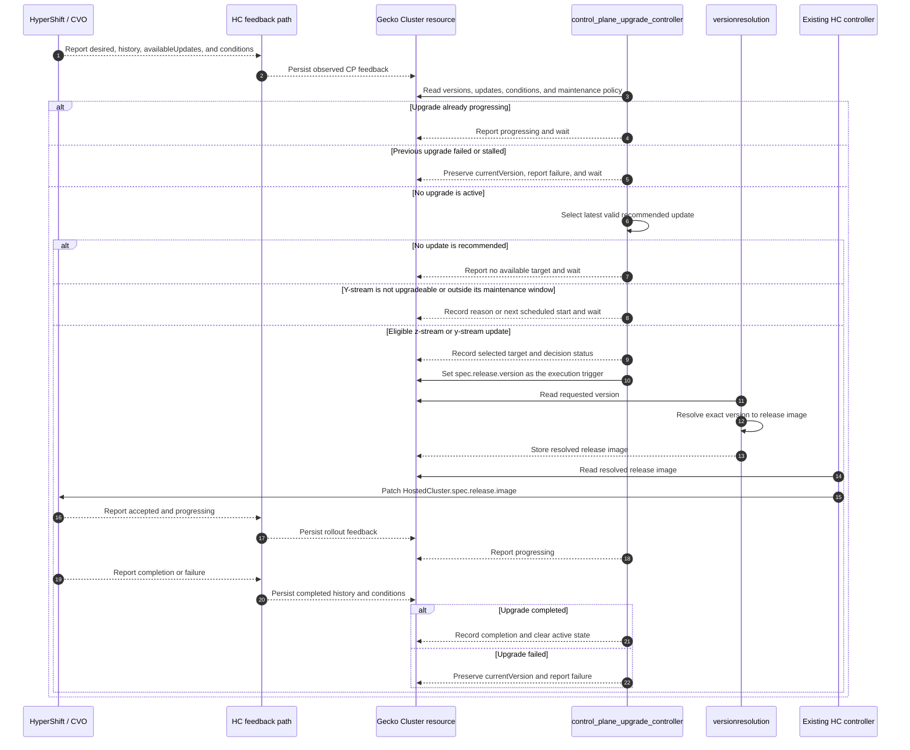
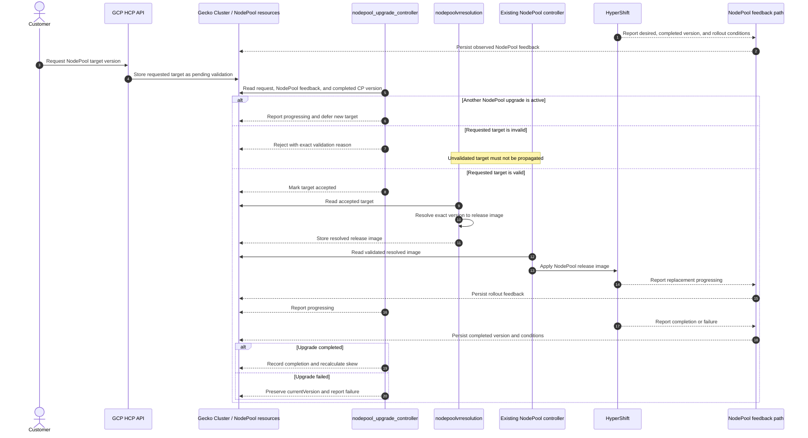

# Hosted Cluster Upgrade Controllers Implementation Plan

## Purpose

Implement safe upgrades for GCP Hosted Control Planes (HCP), based on the [Hosted Cluster Upgrade Policy](../design-decisions/infrastructure/hosted-cluster-upgrade-policy.md).

- Control-plane upgrades are mandatory and platform-managed.
- Customers may start a control-plane upgrade early to an available version.
- NodePool upgrades are customer-triggered.
- Gecko decides when an upgrade may start and which version to request.
- Existing Gecko controllers resolve and apply the release image.
- HyperShift and CVO perform the rollout and report its status.

The implementation is divided into three milestones:

1. Deliver automatic control-plane upgrades using the latest update recommended for each Cluster while respecting customer maintenance controls, plus customer-triggered NodePool upgrades.
2. Add a managed release gate, platform default version, progressive delivery, and emergency rollout controls.
3. Add customer-initiated control-plane upgrades.

## Controllers

### `control_plane_upgrade_controller`

Responsible for:

- platform-initiated automatic control-plane upgrades in Milestone 1;
- customer-initiated control-plane upgrades in Milestone 3;
- selecting the next valid target;
- applying maintenance windows and exclusions;
- requesting an upgrade through the Cluster API;
- tracking progress, completion, failure, and stalls.

### `nodepool_upgrade_controller`

Responsible for:

- validating customer-requested NodePool targets;
- tracking completed and target NodePool versions;
- calculating control-plane-to-NodePool version skew;
- reporting skew warnings and out-of-support status;
- tracking progress, completion, failure, and stalls.

It does not automatically select or initiate NodePool upgrades.

Neither controller performs a rollout. HyperShift and CVO perform the control-plane rollout, while HyperShift performs NodePool replacement.

## Version model

Each Cluster and NodePool has two observed versions supplied by HyperShift feedback.

| Field | Meaning |
|---|---|
| `currentVersion` | Last version HyperShift reports as successfully completed |
| `targetVersion` | Version HyperShift reports as its desired version |

The HC or NodePool feedback path owns these observed values. Upgrade controllers consume them but do not manufacture them.

`currentVersion` does not change while an upgrade is requested, progressing, stalled, or failed.

```text
Idle:         current=4.22.0  target=4.22.0
Requested:    current=4.22.0  target=4.23.0
Progressing:  current=4.22.0  target=4.23.0
Failed:       current=4.22.0  target=4.23.0
Completed:    current=4.23.0  target=4.23.0
```

## Existing OCP version components

| Component | Location | Responsibility | Use in this implementation |
|---|---|---|---|
| Version Discovery API | Planned GCP HCP platform API | Retrieves Cincinnati releases, applies GCP HCP support and validation rules, caches results, and exposes default/latest versions and release metadata | Use for version discovery, cluster creation, and platform support metadata; it is not the Milestone 1 per-Cluster upgrade-path source |
| Cluster version resolution | `gecko/controllers/versionresolution` | Finds an explicitly requested Cluster version in Cincinnati and resolves it to an image | Reuse after a CP target is selected |
| NodePool version resolution | `gecko/controllers/nodepoolvrresolution` | Finds an explicitly requested NodePool version in Cincinnati and resolves it to an image | Reuse after a NodePool target passes validation |
| HyperShift supported versions | `hypershift/support/supportedversion` | Reads the HyperShift Operator `supported-versions` ConfigMap and validates supported versions and skew | Retain as an execution-side compatibility guard |
| HyperShift/CVO available updates | `HostedCluster.status.version.availableUpdates` | Reports recommended updates for a specific Cluster | Use as the Milestone 1 CP target source |

The planned Version Discovery API becomes the platform-owned Cincinnati integration for version discovery and cluster-creation defaults. HyperShift/CVO remains the source of cluster-specific recommended upgrade paths.

In Milestone 1, `control_plane_upgrade_controller` may select the latest recommended entry directly from the Cluster's `HostedCluster.status.version.availableUpdates`. The Version Discovery API may provide support metadata or an additional platform-support check, but its `default` and `latest` fields are not required to choose that per-Cluster target.

The existing Gecko Cincinnati client confirms that an exact version exists and returns its release image. It does not validate upgrade edges. As the Version Discovery API is introduced, the team should decide whether the existing resolution controllers continue querying Cincinnati or consume the platform API/cache to avoid duplicate integration paths.

## Milestone 1: Automatic control-plane upgrade capability

Milestone 1 upgrades each eligible control plane to the latest version in that Cluster's `HostedCluster.status.version.availableUpdates`, while respecting customer controls.

Customer-initiated control-plane upgrades are not part of Milestone 1. They are added in Milestone 3. Customer-triggered NodePool upgrades remain part of Milestone 1.

There is no separate platform default or progressive rollout gate in this milestone. When a new version becomes recommended in a Cluster's channel, all eligible Clusters in that channel may begin upgrading according to their maintenance policies.

Automatic production enablement must be explicit because this behavior can make the entire eligible fleet act on a newly published update.

### 1.1 Control-plane upgrade controller

#### Version Discovery API relationship

The platform Version Discovery API provides:

- versions supported and validated for GCP HCP;
- default and latest supported versions;
- version, release image, channel, and support metadata;
- cached results and explicit error behavior when Cincinnati is unavailable.

Do not add another direct Cincinnati client to `control_plane_upgrade_controller`. In Milestone 1, the controller selects from HyperShift's cluster-specific `availableUpdates`. The Version Discovery API remains available for customer version listing, cluster-creation defaulting, release metadata, and any agreed platform-support check.

#### Feedback prerequisites

Extend the HostedCluster feedback path to carry:

- `status.version.availableUpdates`;
- `status.version.desired`;
- completed version history;
- `ClusterVersionUpgradeable`;
- `ClusterVersionProgressing`;
- `ClusterVersionAvailable`;
- `ClusterVersionReleaseAccepted`;
- `Available`;
- `Degraded`.

Store the observed versions and available updates in an HC-owned result field in Gecko Cluster status. Add transport and HC-controller tests proving that these values flow from the management cluster to Gecko.

#### Automatic control-plane upgrade sequence



#### Control-plane reconciliation

1. Read the Cluster and the latest HC-owned HyperShift feedback.
2. Derive the observed `currentVersion`, `targetVersion`, and rollout conditions.
3. If an upgrade is progressing, report it as progressing and wait. Do not select another target.
4. If HyperShift reports successful completion, observe the new `currentVersion`, record completion, and clear the controller's active state.
5. If the upgrade failed or stalled, preserve `currentVersion`, retain the failed target and reason, and stop automatic target selection.
6. If no upgrade is active, read this Cluster's `HostedCluster.status.version.availableUpdates` from Gecko's HC feedback.
7. Select the latest recommended version that is a valid next step for this Cluster. If the list is empty, wait and report that no upgrade is currently recommended.
8. If the team requires a separate GCP HCP support check in Milestone 1, confirm the selected version against the Version Discovery API without using its creation `default` as the upgrade target.
9. For a y-stream update, require `ClusterVersionUpgradeable=True` and evaluate the customer's maintenance window and exclusions. If the current time is outside the permitted window, record the next scheduled start and wait.
10. For a z-stream update, bypass maintenance controls while retaining target, concurrency, and applicable health checks.
11. In Milestone 2, require managed-side progressive-rollout authorization for automatic upgrades.
12. Calculate projected NodePool skew and report warnings or out-of-support status. Do not block a mandatory CP upgrade because of NodePool skew.
13. Update `Cluster.spec.release.version` with the selected target.
14. Resolve the version to an image through the agreed platform version-resolution path.
15. Allow the existing HC controller to apply the image to `HostedCluster.spec.release.image`.
16. Wait for HyperShift to accept and begin the rollout before reporting it as progressing.
17. Continue observing until HyperShift reports completion or failure.

The controller must be idempotent and recover correctly after restart.

#### Sequential minor upgrades

Control-plane minor upgrades follow valid sequential steps.

```text
Latest channel goal: 4.24
Current:             4.22
Next target:         a recommended 4.23 release
```

After 4.23 completes, the controller reevaluates health and `availableUpdates` before requesting 4.24.

### 1.2 NodePool upgrade controller

#### Feedback prerequisites

Extend the HyperShift NodePool feedback path to carry:

- desired NodePool version;
- completed NodePool version;
- `Ready`;
- `UpdatingVersion`;
- `AllNodesHealthy`;
- `AllMachinesReady`;
- available failure reason and message.

Do not derive the completed version from `NodePool.spec.release.version`.

#### Customer-triggered NodePool upgrade sequence



#### NodePool reconciliation

1. Read the NodePool and its latest HyperShift feedback.
2. Read the parent Cluster's completed CP `currentVersion`.
3. Derive the NodePool's observed `currentVersion`, `targetVersion`, and rollout conditions.
4. If an upgrade is progressing, report it as progressing and wait. Do not accept another target.
5. If HyperShift reports successful completion, observe the new `currentVersion`, record completion, and clear the controller's active state.
6. If the upgrade failed or stalled, preserve `currentVersion`, retain the failed target and reason, and wait for remediation.
7. Calculate skew between the completed CP and NodePool versions.
8. Clear skew status in the normal range, warn when approaching the supported limit, and report out-of-support status when the limit is exceeded.
9. If no upgrade is active, detect a customer-requested target different from `currentVersion`.
10. Validate the target before it reaches HyperShift:
    - it is not newer than the completed CP version;
    - it is newer than the completed NodePool version;
    - it remains within the supported skew policy;
    - it follows approved NodePool path rules, including EUS behavior;
    - channel requirements are compatible with the parent Cluster.
11. If validation fails, report the exact reason and prevent propagation.
12. If validation succeeds, mark the request accepted.
13. Allow the existing NodePool version-resolution controller to resolve the version to an image.
14. Allow the existing NodePool controller to apply the image to HyperShift.
15. Observe the rollout until completion or failure, then recalculate skew and support status.

NodePool upgrades remain customer-triggered. NodePool skew does not block a mandatory CP upgrade.

### 1.3 API changes

Add API fields for:

- Cluster maintenance policy;
- HC-observed current version, target version, and available updates;
- CP scheduled target, target source, target reason, lifecycle state, completion time, and failure information;
- NodePool-observed current and target versions;
- NodePool validation state, CP version, version skew, completion time, and failure information.

Define separate ownership for observed feedback and controller decisions. Generate public types, schemas, conversions, and deepcopy code using the repository's normal generation workflow.

Coordinate these changes with the Version Discovery API contract. Upgrade controllers should consume its stable platform API types instead of defining a second representation of supported release metadata.

### 1.4 Maintenance policy and window

Add customer-facing configuration for:

- an RFC 5545 recurring maintenance window;
- window duration;
- timezone, defaulting to UTC;
- up to three maintenance exclusions.

Validate:

- minimum window duration of four hours;
- no more than three exclusions;
- maximum duration of 30 days for each exclusion;
- exclusion end after exclusion start;
- at least 48 available maintenance hours in every rolling 32-day period;
- overlapping exclusions as the union of excluded time.

A window controls when a y-stream upgrade may start. It does not stop an active upgrade after the window closes.

For automatic y-stream upgrades, this maintenance policy is the customer's schedule. Customer-initiated CP scheduling is deferred to Milestone 3.

### 1.5 Failure and status-update safety

For both controllers:

- preserve the last completed `currentVersion`;
- retain the failed `targetVersion` and reason;
- do not select another automatic target;
- do not attempt an automatic downgrade;
- emit an operational metric and alert;
- require a defined retry or remediation action.

Each status field and condition has one owning controller.

| Owner | Fields and conditions |
|---|---|
| HC controller | HostedCluster availability, observed current/target versions, available updates, and raw CP feedback |
| Cluster version-resolution controller | Resolved Cluster release information and `VersionResolved` |
| `control_plane_upgrade_controller` | Scheduled target, target source/reason, decision state, failure state, and CP upgrade conditions |
| NodePool feedback path | Observed NodePool current/target versions and rollout feedback |
| NodePool version-resolution controller | Resolved NodePool release information and `NodePoolVersionResolved` |
| `nodepool_upgrade_controller` | Validation state, skew warning, support state, failure state, and NodePool upgrade conditions |

Status writers refetch the latest object inside `RetryOnConflict`, modify only fields they own, and preserve fields written by other controllers.

### 1.6 Deployment and validation

For each controller, add:

- reconciler package and tests;
- command/subcommand wiring;
- resource watches;
- RBAC permissions;
- a dedicated Helm chart consistent with existing Gecko controllers;
- health and readiness probes;
- resource requests and limits;
- environment-specific configuration.

Test at least:

- successful z-stream and y-stream CP upgrades;
- maintenance-window and exclusion behavior;
- sequential minor upgrades;
- valid and invalid NodePool targets;
- NodePool skew warning, out-of-support state, and support restoration;
- failed and stalled upgrades;
- controller restart and duplicate reconciliation;
- stale or unavailable feedback;
- concurrent status-update conflicts;
- overlapping manual and automatic CP requests;
- multiple eligible Clusters.

Initially enable automatic upgrades only for explicitly selected development Clusters. Before production, provide metrics, alerts, customer events, dashboards, and remediation runbooks.

## Milestone 2: Managed release gate and progressive delivery

Milestone 2 prevents every Cluster in a channel from immediately acting on a newly published release.

### 2.1 Platform default version

Introduce a platform-managed channel target that may differ from the latest version published in Cincinnati.

```text
Cincinnati latest: 4.23.8
Platform default:  4.23.7
```

The Version Discovery API already requires exactly one default and one latest supported version for discovery and cluster creation. Confirm whether its default is also intended to become the automatic fleet-upgrade target. If it is, Milestone 2 should reuse that field rather than introduce a second default-version store. If it is not, the upgrade default needs its own explicitly named field and ownership.

The platform promotes the upgrade default only after its validation criteria pass. Define how it is promoted automatically and whether promotion is global or regional.

### 2.2 Managed-side upgrade gate

Add a gate so `control_plane_upgrade_controller` acts only when the Cluster is authorized for the promoted target.

```text
Available from CVO
        |
Platform default permits target
        |
Progressive rollout authorizes Cluster
        |
Customer controls permit start
        |
Upgrade requested
```

The gate must support pause and resume without changing customer configuration.

### 2.3 Progressive rollout

Define and automate:

- rollout order, such as development, integration, stage, and production;
- regional or cohort-based authorization;
- concurrency limits;
- health and failure thresholds;
- automatic pause after failures;
- emergency stop and resume ownership;
- rollout metrics and dashboards.

### 2.4 Cincinnati emergency controls

Document how to disable an unsafe upgrade path in Cincinnati, including the use of conditional edges where appropriate.

The operational procedure must identify:

- who can request an edge change;
- how an affected version or path is identified;
- how quickly the change reaches CVO clients;
- how already-started upgrades are handled;
- how the path is restored after remediation.

Cincinnati edge controls stop new affected upgrades. They do not replace the platform-side progressive gate, which limits blast radius before a fleet-wide problem occurs.

## Milestone 3: Customer-initiated control-plane upgrades

Milestone 3 allows a customer to request an approved CP upgrade ahead of the platform's automatic schedule.

The request must use the same safety and execution path as an automatic upgrade:

1. The customer selects a version exposed by the GCP HCP Version Discovery API.
2. `control_plane_upgrade_controller` confirms that the version is supported by GCP HCP.
3. The controller confirms that the target, or a required intermediate step toward it, appears in the Cluster's `HostedCluster.status.version.availableUpdates`.
4. The controller checks that no other CP upgrade is active.
5. For a y-stream request, the controller checks `ClusterVersionUpgradeable=True`.
6. The controller applies the agreed customer scheduling behavior.
7. The controller records `targetSource=customer` and the requested target.
8. The existing version-resolution and HC controllers resolve and apply the target.
9. HyperShift/CVO performs the rollout, and the controller observes it through completion or failure.

Customer initiation does not permit a downgrade, an unsupported target, or bypassing HyperShift/CVO upgrade readiness.

## Delivery order

1. Milestone 1 feedback and API foundations
2. Milestone 1 control-plane controller
3. Milestone 1 NodePool controller
4. Milestone 1 maintenance, failure handling, tests, and development enablement
5. Milestone 2 platform default and managed-side gate
6. Milestone 2 progressive rollout and Cincinnati emergency runbook
7. Milestone 3 customer-initiated control-plane upgrade API and controller behavior
8. CLI support, customer notifications, dashboards, runbooks, and production enablement

## Open team decisions

### Milestone 1

1. Do the existing version-resolution controllers continue querying Cincinnati, or consume the Version Discovery API/cache?
2. May only one minor-version step start in each maintenance-window occurrence?
3. Which degraded conditions block z-stream upgrades, and which permit an emergency override?
4. Does the Version Discovery API need to expose NodePool upgrade paths, or only supported versions?
5. What is the authoritative source for valid NodePool upgrade paths?
6. How does NodePool validation gate the existing NodePool controller?
7. Where is NodePool out-of-support status exposed, and who sends customer notifications?
8. What defines a stalled upgrade, and who owns retry and remediation?

### Milestone 2

1. Is the Version Discovery API default also the automatic fleet-upgrade target?
2. Are defaults promoted globally or region by region?
3. How does an individual Cluster receive progressive-rollout authorization?
4. What health and failure thresholds pause promotion?
5. Who owns the emergency stop and Cincinnati edge-change procedures?

### Milestone 3

1. Does a customer-initiated CP upgrade start immediately, use the recurring maintenance window, or support a separate one-time schedule?
2. When customer and automatic CP targets overlap, which takes precedence?
3. May customer-initiated upgrades bypass the automatic rollout wave?
4. What API resource or fields represent the customer's request and its status?

## Upgrade readiness source

HyperShift and CVO are authoritative for whether a particular control plane is ready to upgrade. Gecko consumes the conditions exposed on the HostedCluster instead of recreating CVO's component-level readiness checks.

For a y-stream upgrade, require:

- `ClusterVersionUpgradeable=True`;
- `ClusterVersionProgressing=False`;
- `ClusterVersionAvailable=True`;
- HostedCluster `Available=True`;
- HostedCluster `Degraded=False`;
- the selected target in `status.version.availableUpdates`.

If `ClusterVersionUpgradeable` is false or unknown, Gecko records its reason and message and waits. It does not reproduce or override CVO's component-level validation.

For a z-stream upgrade, Gecko follows HyperShift's supported behavior and does not require `ClusterVersionUpgradeable=True`. It still requires a recommended target, no active upgrade, and applicable availability and health gates.
