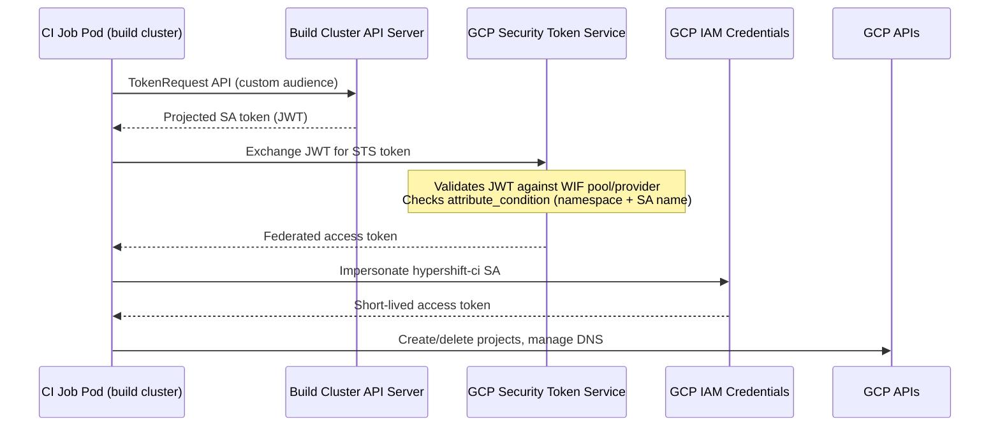

# Hypershift CI Workload Identity Federation Migration

## Overview

Migrate the `hypershift-ci` service account authentication from a static JSON key to Workload Identity Federation (WIF), using the OpenShift CI build cluster OIDC issuers. CI job pods will exchange their projected Kubernetes SA token for a short-lived GCP federated access token via STS, then impersonate the existing `hypershift-ci` service account.

This eliminates long-lived credentials per [Architectural Invariant #3](../design-decisions/workload-identity-implementation.md) and follows the same WIF pattern used for hosted cluster operators in [gcp-wif-integration](./gcp-wif-integration.md), adapted for external (non-GKE) OIDC issuers.

**Design decision**: [prow-ci-workload-identity-federation](../design-decisions/prow-ci-workload-identity-federation.md)

**Study**: [rosa-to-gcp-wif](../studies/rosa-to-gcp-wif.md) — validated the WIF token exchange flow on the `app.ci` ROSA cluster. This implementation targets the **build farm clusters** where hypershift GCP e2e jobs run.

**Security scoping:**

Federation is restricted to specific CI test jobs via a CEL attribute condition on the WIF provider that matches on both the ci-operator namespace prefix and the K8s ServiceAccount name:

```cel
assertion['kubernetes.io']['namespace'].startsWith('ci-op-') &&
assertion['kubernetes.io']['serviceaccount']['name'] in ['e2e-gke', 'e2e-v2-gke']
```

ci-operator creates one K8s ServiceAccount per multi-stage test, named after the test's `as` field. All steps (pre, test, post) within that test share this SA. The SA names are stable — defined in `ci-operator/config/openshift/hypershift/openshift-hypershift-main.yaml`. If new test names are added, the attribute condition must be updated. See `openshift/ci-tools` `pkg/steps/multi_stage/init.go` (SA creation) and `pkg/steps/multi_stage/gen.go` (SA assignment to step pods).

Additional mitigation layers:
- **Custom audience**: The WIF provider requires a specific audience, rejecting the default projected token. CI scripts must explicitly request a token with `kubectl create token --audience=...`.
- **CI folder isolation** (hard boundary): The SA's permissions are scoped exclusively to the CI folder. No path to production, integration, or staging resources regardless of authentication method.

**Pool and provider architecture:**

A single WIF pool (`openshift-ci`) with one OIDC provider per build cluster. This keeps IAM simple — one `principalSet://` binding on the SA covers all providers, and the attribute condition is consistent across clusters. Adding or removing a build cluster is a single Terraform change (add/remove a provider) with no IAM modifications. If trust needs to be revoked for a specific cluster, its provider can be deleted or disabled within the pool without affecting others. The Terraform module uses `for_each` on a `wif_providers` variable map of `{ provider_id => issuer_uri }`.

**Authentication flow:**



---

## Card 1: Create WIF Infrastructure

### User Story

**As a** GCP HCP platform engineer,
**I want** a WIF pool and OIDC providers configured in the `gcp-hcp-hypershift-ci` project,
**so that** CI build clusters can federate identities to the `hypershift-ci` service account without static keys.

### Context / Background

The `hypershift-ci` service account authenticates CI jobs to GCP for creating/deleting ephemeral test projects. Currently it uses a static JSON key stored in Vault. This card provisions the GCP-side WIF infrastructure that will allow CI pods to authenticate via token exchange instead.

### Technical Approach

Single PR in `gcp-hcp-infra` containing all Terraform changes. The first `atlantis apply` may fail due to IAM propagation delay (up to 60 seconds) between the new `workloadIdentityPoolAdmin` role and the WIF pool creation — a re-run of `atlantis apply` will succeed.

1. **Enable STS API** (modify: `terraform/modules/hypershift-ci/variables.tf`):
   - Add `sts.googleapis.com` to the `activated_apis` default list

2. **Grant Atlantis WIF pool admin** (modify: `terraform/modules/hypershift-ci/atlantis.tf`):
   - Add `google_project_iam_member.global_atlantis_wif_pool_admin` with `roles/iam.workloadIdentityPoolAdmin`
   - Add it to `null_resource.atlantis_iam_ready` depends_on list

3. **Add WIF variables** (modify: `terraform/modules/hypershift-ci/variables.tf`):
   - `wif_pool_id` (default: `"openshift-ci"`) - Pool ID for OpenShift CI federation
   - `wif_providers` - Map of provider configurations:
     ```hcl
     variable "wif_providers" {
       description = "Map of WIF OIDC providers, keyed by provider ID"
       type = map(object({
         issuer_uri = string
       }))
       # Populate with all build clusters that have the arm64 capability
       default = {
         build01 = { issuer_uri = "https://build01-oidc.s3.us-east-1.amazonaws.com" }
         # ... add all arm64-capable clusters
       }
     }
     ```
   - `wif_attribute_condition` - CEL condition restricting federation to specific CI test service accounts:
     ```hcl
     default = "assertion['kubernetes.io']['namespace'].startsWith('ci-op-') && assertion['kubernetes.io']['serviceaccount']['name'] in ['e2e-gke', 'e2e-v2-gke']"
     ```
   - Add input validation for all variables

4. **Create WIF resources** (new file: `terraform/modules/hypershift-ci/workload-identity-federation.tf`):
   - `google_iam_workload_identity_pool.openshift_ci` - Single WIF pool for all build clusters
   - `google_iam_workload_identity_pool_provider.build_clusters` - One OIDC provider per entry in `wif_providers` (using `for_each`), each with:
     - `allowed_audiences` set to a custom string (e.g., `gcp-hcp-hypershift-ci-wif`) shared across all providers — NOT the default issuer URL
     - Attribute mapping: `google.subject` = `assertion.sub`, `attribute.namespace` = `assertion['kubernetes.io']['namespace']`, `attribute.service_account` = `assertion['kubernetes.io']['serviceaccount']['name']`
     - Attribute condition from variable (restricts to `ci-op-*` namespaces AND specific test SA names)
   - `google_service_account_iam_member.wif_workload_identity_user` - Allow federated identities (`principalSet://.../openshift_ci/*`) to impersonate the `hypershift-ci` SA
   - Pool and providers depend on `null_resource.atlantis_iam_ready`

5. **Add WIF outputs** (modify: `terraform/modules/hypershift-ci/outputs.tf` and `terraform/config/hypershift-ci/main.tf`):
   - `wif_pool_name` - Full resource name of the WIF pool
   - `wif_provider_names` - Map of provider ID to full resource name (for CI script lookup)
   - `project_number` - GCP project number

6. **Clean up static key references**:
   - Remove SA key generation instructions from `terraform/modules/hypershift-ci/service-account.tf` header comment
   - Remove SA key generation instructions from `terraform/config/hypershift-ci/main.tf` header comment
   - Replace with WIF authentication documentation pointing to `workload-identity-federation.tf`

### Acceptance Criteria

- [ ] `sts.googleapis.com` is in the activated APIs list
- [ ] Atlantis SA has `roles/iam.workloadIdentityPoolAdmin` on the `gcp-hcp-hypershift-ci` project
- [ ] WIF pool `openshift-ci` exists in `gcp-hcp-hypershift-ci` project with one OIDC provider per WIF-compatible build cluster
- [ ] Attribute condition restricts federation to `ci-op-*` namespaces AND specific test SA names (`e2e-gke`, `e2e-v2-gke`)
- [ ] `hypershift-ci` SA has `roles/iam.workloadIdentityUser` binding for the WIF pool principal set
- [ ] `terraform output -json wif_provider_names` returns provider names for all configured clusters
- [ ] No static key generation comments remain in Terraform files
- [ ] `make terraform-check` passes

---

## Card 2: Migrate CI Scripts and Revoke Static Key

### User Story

**As a** GCP HCP platform engineer,
**I want** CI step scripts to authenticate via WIF token exchange instead of static JSON keys,
**so that** the static key can be revoked and removed from Vault.

### Context / Background

Card 1 provisions the WIF infrastructure in GCP. This card updates the CI step scripts in `openshift/release` to use that infrastructure, validates the migration, and revokes the static key.

### Technical Approach

#### Update CI step scripts to use WIF (`openshift/release`)

**Prerequisites**: Card 1 complete (WIF pool and providers exist and are applied).

1. **Update GCP authentication in CI steps** (modify: `ci-operator/step-registry/hypershift/gcp/` scripts):
   - Detect the build cluster's OIDC issuer from the pod's projected token and map it to the corresponding WIF provider
   - Request a token with the custom WIF audience via the TokenRequest API
   - Write a GCP credential configuration file pointing to the token and authenticate with `gcloud auth login --cred-file`
   - Remove references to cluster profile JSON key file
   - Ensure `kubectl` and `jq` are available in the CI step image
   - Fail fast with a clear error if the OIDC issuer is not recognized

2. **Ensure jobs only land on WIF-compatible clusters**:
   - Jobs are pinned to AWS build clusters via the existing `arm64` capability, which is only available on clusters with public OIDC issuers

3. **Run `make update`** to regenerate Prow job configs

#### Post-validation: Revoke static key

**Prerequisites**: CI script PR merged, at least one full CI run passing with WIF.

1. Revoke the user-managed key: `gcloud iam service-accounts keys delete KEY_ID --iam-account=hypershift-ci@gcp-hcp-hypershift-ci.iam.gserviceaccount.com`
2. Remove the key from Vault (selfservice.vault.ci.openshift.org)
3. Monitor `e2e-gke` jobs for 24-48 hours after key revocation

### Dependencies

- **Card 1**: WIF pool and OIDC providers must be applied before this card starts.

### Acceptance Criteria

- [ ] CI step scripts authenticate via TokenRequest API and `gcloud auth login --cred-file` (no static key)
- [ ] `e2e-gke` rehearsal job passes end-to-end with WIF authentication
- [ ] Jobs fail fast with a clear error if they land on a cluster without a public OIDC issuer
- [ ] Authentication fails when using a token without the correct audience
- [ ] No user-managed keys exist on the `hypershift-ci` service account
- [ ] Key is removed from Vault

---

## Concerns and Mitigations

| Concern | Mitigation |
|---------|-----------|
| **GCP build clusters lack public OIDC** | Jobs are pinned to AWS build clusters via the `arm64` capability. |
| **Federation scope**: Attribute condition must be updated when new test names are added | Condition matches on both namespace (`ci-op-*`) and SA name (`e2e-gke`, `e2e-v2-gke`). Adding a new test requires updating `wif_attribute_condition`. |
| **OIDC issuer stability**: If a build cluster is rebuilt, the issuer URL or signing keys change | One WIF provider per cluster. Broken provider only affects that cluster's jobs. Variable-driven config allows quick updates. |
| **Token lifetime**: The static key never expires; WIF tokens do. CI steps can run for 2-3 hours. | Validate token expiration behavior during implementation. The GCP SDK may re-read the token file and re-exchange automatically, or the script may need to refresh the token periodically. |
| **Rollback path**: If WIF breaks CI | Keep the static key in Vault until post-validation. Only revoke after confirmed stability. |
| **New build clusters added**: Future clusters may or may not have public OIDC | Add new WIF providers to Terraform as clusters are added. CI scripts fail fast on unrecognized issuers. |

